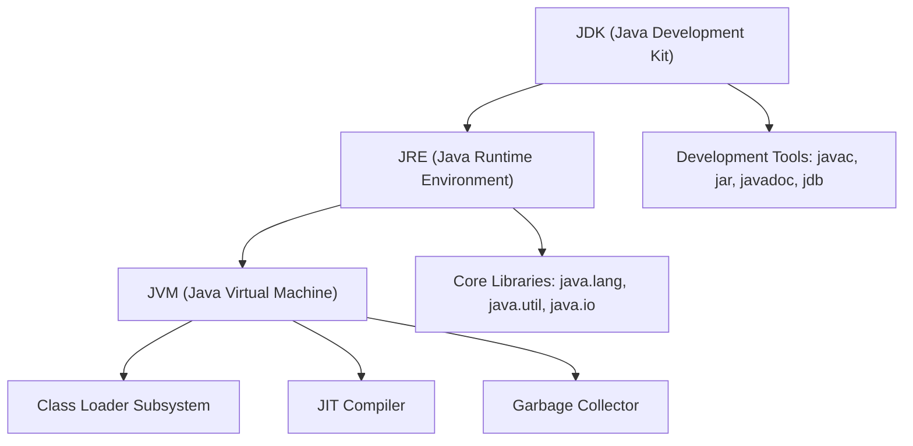
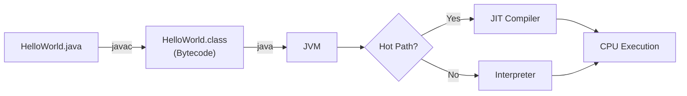
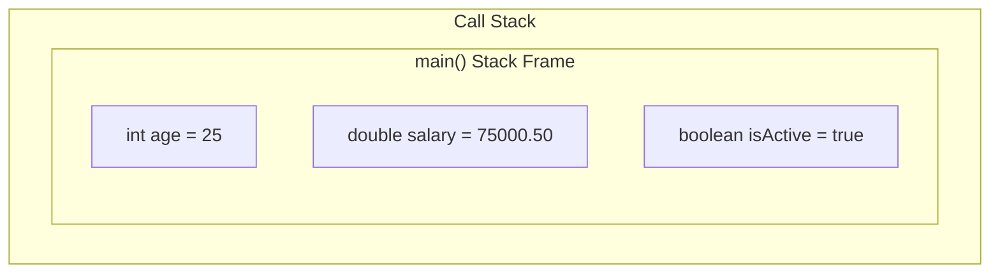
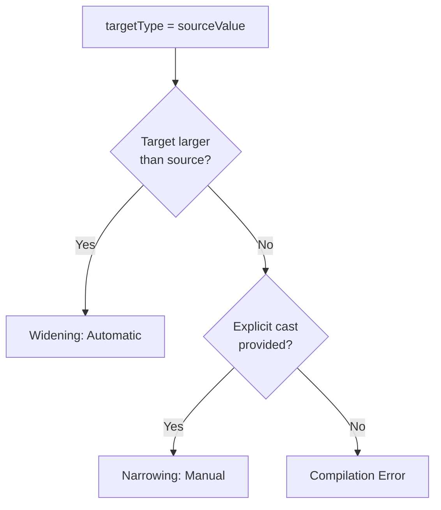

# Module 01: Java Foundations

[Back to Index](README.md) | [Next: Control Flow](02_control_flow.md)

---

## 1.1 The Java Ecosystem: JVM, JDK, and JRE

Before writing a single line of Java, it is essential to understand the three pillars of the Java platform.

### 1.1.1 Java Virtual Machine (JVM)

The JVM is an abstract computing machine that provides the runtime environment in which Java bytecode is executed. It is platform-specific -- a different JVM implementation exists for Windows, macOS, and Linux -- but it executes the same platform-independent bytecode. This is the mechanism behind Java's "Write Once, Run Anywhere" principle.

Key responsibilities of the JVM:
- **Class Loading**: Locates and loads `.class` files into memory.
- **Bytecode Verification**: Ensures loaded bytecode does not violate security constraints.
- **Execution**: Interprets bytecode or compiles it to native code via the Just-In-Time (JIT) compiler.
- **Memory Management**: Allocates and deallocates memory through automatic garbage collection.

### 1.1.2 Java Runtime Environment (JRE)

The JRE contains everything needed to **run** a compiled Java application:
- The JVM.
- Core class libraries (`java.lang`, `java.util`, `java.io`).
- Supporting configuration and security files.

The JRE does **not** include development tools such as the compiler (`javac`).

### 1.1.3 Java Development Kit (JDK)

The JDK is the superset that includes the JRE plus all tools required to **develop** Java applications:
- `javac` -- the Java compiler.
- `jar` -- the archive tool for packaging `.class` files.
- `javadoc` -- the documentation generator.
- `jdb` -- the debugger.
- `jshell` -- the interactive REPL (JDK 9+).

### 1.1.4 Relationship Diagram



---

## 1.2 The Compilation Flow: Source to Execution

Java uses a two-stage compilation model that distinguishes it from purely compiled languages (C++) and purely interpreted languages (Python).

### 1.2.1 Stage 1: Source Code to Bytecode

The Java compiler (`javac`) reads `.java` source files and translates them into `.class` files containing **bytecode** -- a platform-independent intermediate representation.

### 1.2.2 Stage 2: Bytecode to Machine Code

When you execute `java HelloWorld`, the JVM loads the `.class` file and interprets the bytecode. For hot code paths, the JIT compiler translates bytecode into native machine instructions at runtime.

### 1.2.3 Compilation Pipeline



---

## 1.3 Primitive Data Types

Java defines eight primitive data types. These are not objects; they are stored directly on the stack and have fixed sizes.

### 1.3.1 Primitive Type Reference

| Type | Size | Default | Range |
|------|------|---------|-------|
| `byte` | 8 bits | 0 | -128 to 127 |
| `short` | 16 bits | 0 | -32,768 to 32,767 |
| `int` | 32 bits | 0 | -2^31 to 2^31 - 1 |
| `long` | 64 bits | 0L | -2^63 to 2^63 - 1 |
| `float` | 32 bits | 0.0f | ~6-7 decimal digits |
| `double` | 64 bits | 0.0d | ~15 decimal digits |
| `char` | 16 bits | '\u0000' | 0 to 65,535 (Unicode) |
| `boolean` | JVM-specific | false | true / false |

### 1.3.2 Stack Memory for Primitives



---

## 1.4 Type Casting Rules

### 1.4.1 Widening (Implicit) Casting

Widening occurs automatically when a smaller type is assigned to a larger type. No data is lost.

```
byte --> short --> int --> long --> float --> double
```

### 1.4.2 Narrowing (Explicit) Casting

Narrowing requires a manual cast because data loss is possible.

```java
double pi = 3.14159;
int truncatedPi = (int) pi;  // Value becomes 3
```

### 1.4.3 Casting Decision Flowchart



---

## 1.5 Wrapper Classes and Autoboxing

Each primitive has a corresponding wrapper class in `java.lang` for use in object-requiring contexts.

| Primitive | Wrapper |
|-----------|---------|
| `int` | `Integer` |
| `double` | `Double` |
| `char` | `Character` |
| `boolean` | `Boolean` |

**Autoboxing**: automatic primitive-to-wrapper conversion. **Unboxing**: the reverse. Both have a performance cost due to heap allocation.

---

## 1.6 The main Method

Every Java application requires a `main` method as its entry point:

```java
public static void main(String[] args) { }
```

- `public` -- Accessible by the JVM from outside the class.
- `static` -- Callable without instantiation.
- `void` -- Returns no value.
- `String[] args` -- Command-line arguments.

---

## Code in Practice

```java
/**
 * Module 01: Java Foundations - Code in Practice
 * Demonstrates primitives, type casting, autoboxing, and wrapper utilities.
 */
public class FoundationsDemo {

    public static void main(String[] args) {

        // --- Primitive Data Types ---
        // Primitives are stored on the stack with fixed sizes.
        byte smallNumber = 120;             // 8-bit signed integer
        int standardNumber = 2_000_000;     // 32-bit; underscores improve readability
        long largeNumber = 9_000_000_000L;  // 64-bit; 'L' suffix is mandatory
        double precise = 3.141592653589793; // 64-bit IEEE 754
        char letter = 'A';                 // 16-bit Unicode character
        boolean isJavaFun = true;           // Only true or false

        System.out.println("--- Primitive Data Types ---");
        System.out.println("byte:    " + smallNumber);
        System.out.println("int:     " + standardNumber);
        System.out.println("long:    " + largeNumber);
        System.out.println("double:  " + precise);
        System.out.println("char:    " + letter);
        System.out.println("boolean: " + isJavaFun);

        // --- Widening (Implicit) Cast ---
        // Smaller types automatically promote to larger types without data loss.
        int baseValue = 500;
        long widenedToLong = baseValue;         // int --> long: safe
        double widenedToDouble = widenedToLong;  // long --> double: safe

        System.out.println("\n--- Widening Cast ---");
        System.out.println("int to long:    " + widenedToLong);
        System.out.println("long to double: " + widenedToDouble);

        // --- Narrowing (Explicit) Cast ---
        // Moving to a smaller type requires an explicit cast; data loss is possible.
        double preciseValue = 9.99;
        int truncated = (int) preciseValue; // Fractional part discarded, not rounded

        int overflowExample = 300;
        byte overflowResult = (byte) overflowExample; // 300 exceeds byte range; wraps

        System.out.println("\n--- Narrowing Cast ---");
        System.out.println("double 9.99 to int: " + truncated);    // Output: 9
        System.out.println("int 300 to byte:    " + overflowResult); // Output: 44

        // --- Autoboxing and Unboxing ---
        // Autoboxing wraps a primitive in its object form for collection compatibility.
        Integer boxedInt = standardNumber;  // Autoboxing: int --> Integer
        int unboxedInt = boxedInt;          // Unboxing: Integer --> int

        System.out.println("\n--- Autoboxing / Unboxing ---");
        System.out.println("Boxed Integer: " + boxedInt);
        System.out.println("Unboxed int:   " + unboxedInt);

        // --- Wrapper Utility Methods ---
        // Wrapper classes provide parsing and conversion utilities.
        String numericString = "12345";
        int parsed = Integer.parseInt(numericString);          // String --> int
        String binary = Integer.toBinaryString(parsed);        // int --> binary string

        System.out.println("\n--- Wrapper Utilities ---");
        System.out.println("Parsed from String: " + parsed);
        System.out.println("Binary of 12345:    " + binary);

        // --- Type Limits ---
        // Each wrapper class exposes the range of its corresponding primitive.
        System.out.println("\n--- Type Limits ---");
        System.out.println("int max:  " + Integer.MAX_VALUE);
        System.out.println("int min:  " + Integer.MIN_VALUE);
        System.out.println("long max: " + Long.MAX_VALUE);

        // --- char as a Numeric Type ---
        // char is an unsigned 16-bit integer and can participate in arithmetic.
        char charA = 'A';
        int unicodeValue = charA;               // Widening: char --> int (65)
        char charB = (char) (charA + 1);        // Narrowing: int --> char ('B')

        System.out.println("\n--- char Arithmetic ---");
        System.out.println("'A' as int: " + unicodeValue);
        System.out.println("'A' + 1:    " + charB);
    }
}
```

---

[Back to Index](README.md) | [Next: Control Flow](02_control_flow.md)
