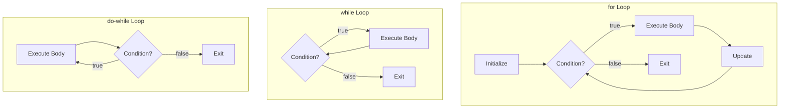
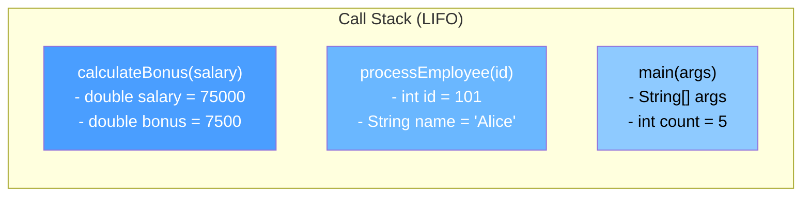

# Module 02: Control Flow

[Previous: Foundations](01_foundations.md) | [Back to Index](README.md) | [Next: Arrays and Strings](03_arrays_strings.md)

---

## 2.1 Conditional Statements

Conditional statements allow a program to choose between different execution paths based on boolean expressions evaluated at runtime.

### 2.1.1 The if / else if / else Chain

The `if` statement is the most fundamental branching construct. The JVM evaluates the boolean condition and executes the corresponding block.

```java
if (condition1) {
    // Executed when condition1 is true
} else if (condition2) {
    // Executed when condition1 is false AND condition2 is true
} else {
    // Executed when all preceding conditions are false
}
```

**Key rules:**
- Conditions must evaluate to a `boolean`. Java does not treat integers as truthy/falsy.
- Curly braces are optional for single-statement bodies, but omitting them is a common source of bugs. Always use braces.
- The `else` block is optional.

### 2.1.2 The switch Statement

The `switch` statement provides multi-way branching based on a single expression. It is more readable than long `if/else if` chains when comparing one variable against multiple constants.

**Supported types**: `byte`, `short`, `int`, `char`, `String` (Java 7+), and `enum`.

```java
switch (expression) {
    case VALUE_1:
        // Code for VALUE_1
        break;          // Without break, execution "falls through" to the next case
    case VALUE_2:
        // Code for VALUE_2
        break;
    default:
        // Code when no case matches
}
```

### 2.1.3 Enhanced switch (Java 14+)

Java 14 introduced the switch expression with arrow syntax, eliminating the need for `break` statements:

```java
String result = switch (dayOfWeek) {
    case 1 -> "Monday";
    case 2 -> "Tuesday";
    case 3 -> "Wednesday";
    default -> "Other";
};
```

---

## 2.2 Loops

Loops enable repeated execution of a block of code. Java provides three loop constructs, each suited to different iteration patterns.

### 2.2.1 The for Loop

Used when the number of iterations is known in advance.

```java
for (initialization; condition; update) {
    // Loop body
}
```

**Execution order**: initialization --> condition check --> body --> update --> condition check --> ...

### 2.2.2 The while Loop

Used when the number of iterations depends on a condition evaluated before each iteration.

```java
while (condition) {
    // Executes as long as condition is true
}
```

### 2.2.3 The do-while Loop

Guarantees at least one execution because the condition is checked after the body.

```java
do {
    // Executes at least once
} while (condition);
```

### 2.2.4 Loop Control Flow Diagram



### 2.2.5 break and continue

- `break` -- Immediately exits the innermost enclosing loop.
- `continue` -- Skips the remainder of the current iteration and proceeds to the next.

---

## 2.3 The Memory Stack During Method Calls

Understanding the call stack is critical for debugging and reasoning about variable scope.

### 2.3.1 Stack Frame Mechanics

Every time a method is called, the JVM creates a **stack frame** on the call stack. This frame stores:
- The method's local variables.
- The method's parameters.
- The return address (where execution resumes after the method returns).

When a method returns, its stack frame is popped and destroyed. All local variables within that frame cease to exist.

### 2.3.2 Stack Frame Diagram



In this diagram, `calculateBonus` is the currently executing method (top of stack). When it returns, its frame is removed and control returns to `processEmployee`.

### 2.3.3 Stack Overflow

If methods call each other recursively without a base case, the stack grows until it exceeds the JVM's allocated stack size, resulting in a `StackOverflowError`.

---

## 2.4 The Ternary Operator

The ternary operator is a compact conditional expression:

```java
variable = (condition) ? valueIfTrue : valueIfFalse;
```

It is an expression, not a statement, so it can be used inline:

```java
String status = (score >= 60) ? "Pass" : "Fail";
```

---

## Code in Practice

```java
/**
 * Module 02: Control Flow - Code in Practice
 * Demonstrates if/else, switch, loops, and method call stack behavior.
 */
public class ControlFlowDemo {

    public static void main(String[] args) {

        // --- Section 1: if / else if / else ---
        // The condition must evaluate to a boolean; Java does not support truthy integers.
        int score = 82;
        String grade;

        if (score >= 90) {
            grade = "A";        // Assigned when score is 90 or above
        } else if (score >= 80) {
            grade = "B";        // Assigned when score is 80-89
        } else if (score >= 70) {
            grade = "C";        // Assigned when score is 70-79
        } else {
            grade = "F";        // Catch-all for scores below 70
        }
        System.out.println("Grade: " + grade);

        // --- Section 2: switch statement ---
        // Preferred over long if/else chains when comparing one variable to constants.
        int dayNumber = 3;
        String dayName;

        switch (dayNumber) {
            case 1:
                dayName = "Monday";
                break;      // break prevents fall-through to the next case
            case 2:
                dayName = "Tuesday";
                break;
            case 3:
                dayName = "Wednesday";
                break;
            default:
                dayName = "Unknown";
                break;      // Good practice: always include a default case
        }
        System.out.println("Day: " + dayName);

        // --- Section 3: for loop ---
        // Used when the iteration count is known at compile time.
        System.out.println("\n--- Multiplication Table (5) ---");
        for (int i = 1; i <= 10; i++) {
            // Each iteration creates 'i' on the stack frame; it is destroyed after the loop
            System.out.println("5 x " + i + " = " + (5 * i));
        }

        // --- Section 4: while loop ---
        // Used when the number of iterations depends on a runtime condition.
        int countdown = 5;
        System.out.println("\n--- Countdown ---");
        while (countdown > 0) {
            System.out.println("T-" + countdown);
            countdown--;    // Without this decrement, the loop would run forever
        }
        System.out.println("Liftoff!");

        // --- Section 5: do-while loop ---
        // Guarantees at least one execution; useful for input validation patterns.
        int attempt = 0;
        do {
            attempt++;
            System.out.println("\nAttempt #" + attempt);
        } while (attempt < 3);

        // --- Section 6: break and continue ---
        System.out.println("\n--- Skip Even Numbers (continue) ---");
        for (int i = 1; i <= 10; i++) {
            if (i % 2 == 0) {
                continue;   // Skip the rest of this iteration for even numbers
            }
            System.out.println("Odd: " + i);
        }

        // --- Section 7: Method calls and the stack ---
        // Each call below creates a new stack frame; inspect the call hierarchy.
        System.out.println("\n--- Method Call Stack Demo ---");
        double salary = 75000.0;
        double bonus = calculateBonus(salary);
        System.out.println("Salary: " + salary + ", Bonus: " + bonus);

        // --- Section 8: Ternary operator ---
        // Compact conditional expression for simple assignments.
        String result = (bonus > 5000) ? "High Bonus" : "Standard Bonus";
        System.out.println("Bonus Category: " + result);
    }

    /**
     * Calculates a 10% bonus. When this method is called, the JVM pushes
     * a new stack frame containing the parameter 'baseSalary' and the
     * local variable 'bonusAmount'. When the method returns, the frame is popped.
     */
    private static double calculateBonus(double baseSalary) {
        double bonusRate = 0.10;                    // Local to this stack frame
        double bonusAmount = baseSalary * bonusRate; // Computed on the stack
        return bonusAmount;                          // Value is returned; frame is destroyed
    }
}
```

---

[Previous: Foundations](01_foundations.md) | [Back to Index](README.md) | [Next: Arrays and Strings](03_arrays_strings.md)
