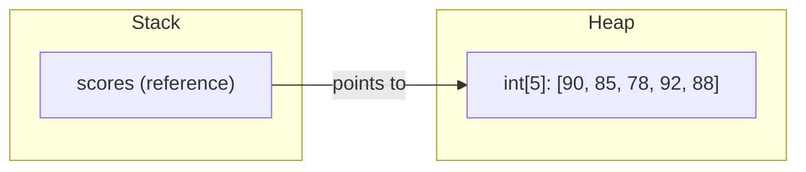
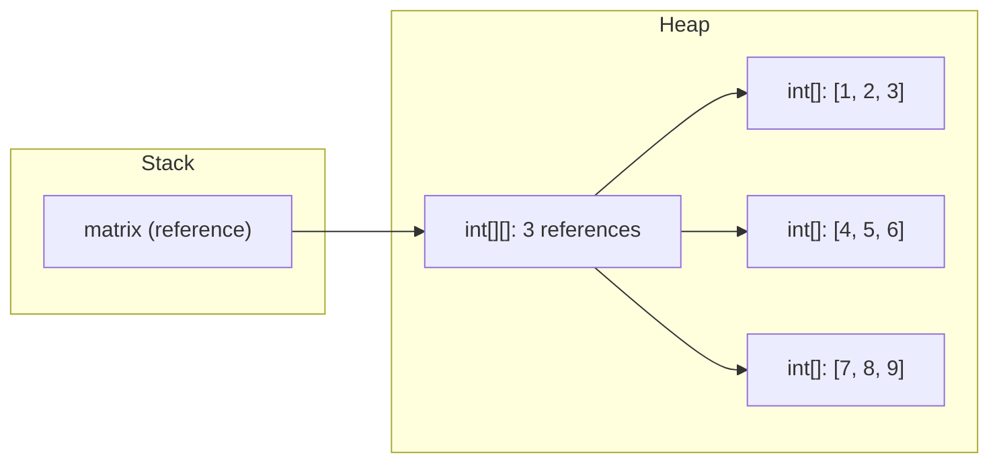
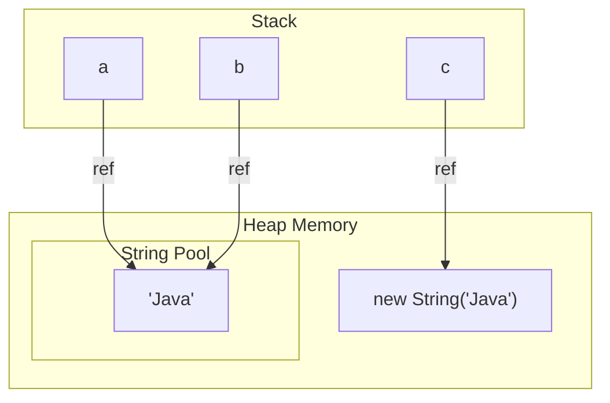

# Module 03: Arrays and Strings

[Previous: Control Flow](02_control_flow.md) | [Back to Index](README.md) | [Next: OOP Basics](04_oop_basics.md)

---

## 3.1 Arrays

An array is a fixed-size, contiguous block of memory that stores elements of the same data type. Once created, an array's length cannot change.

### 3.1.1 Declaration and Initialization

```java
// Declaration and initialization in one step
int[] scores = {90, 85, 78, 92, 88};

// Declaration with explicit size (elements initialized to default values)
double[] prices = new double[5]; // All elements are 0.0

// Declaration and assignment separately
String[] names;
names = new String[]{"Alice", "Bob", "Charlie"};
```

### 3.1.2 Memory Model: Stack and Heap

The array **reference** is stored on the stack. The array **data** is stored on the heap. This distinction is crucial for understanding pass-by-value semantics in Java.



### 3.1.3 Accessing and Iterating

Arrays are zero-indexed. Accessing an index outside `[0, length - 1]` throws an `ArrayIndexOutOfBoundsException`.

```java
int first = scores[0];     // 90
int last = scores[scores.length - 1]; // 88
```

---

## 3.2 Two-Dimensional Arrays

A 2D array is an array of arrays. Each inner array can have a different length (jagged arrays), though rectangular arrays are more common.

### 3.2.1 Declaration and Access

```java
int[][] matrix = {
    {1, 2, 3},
    {4, 5, 6},
    {7, 8, 9}
};
// Access: matrix[row][col]
int center = matrix[1][1]; // 5
```

### 3.2.2 Memory Layout



---

## 3.3 String Immutability

In Java, `String` objects are **immutable**: once created, their content cannot be changed. Any operation that appears to modify a string actually creates a new `String` object.

```java
String greeting = "Hello";
greeting = greeting + " World"; // A NEW String object is created; the old one is eligible for GC
```

### 3.3.1 Why Immutability Matters

- **Thread Safety**: Immutable objects can be shared across threads without synchronization.
- **Security**: Strings used as keys, passwords, or class names cannot be altered after creation.
- **Caching**: The JVM can safely cache and reuse immutable string instances.

---

## 3.4 The String Pool

The JVM maintains a special memory region called the **String Pool** (or String Intern Pool) in the heap. When a string literal is created, the JVM first checks the pool. If an identical string already exists, the existing reference is returned instead of creating a new object.

```java
String a = "Java";        // Created in the String Pool
String b = "Java";        // Reuses the same pool reference
String c = new String("Java"); // Forces a NEW object on the heap (bypasses pool)

System.out.println(a == b);      // true  (same reference)
System.out.println(a == c);      // false (different references)
System.out.println(a.equals(c)); // true  (same content)
```

### 3.4.1 String Pool Diagram



### 3.4.2 Comparing Strings

- `==` compares **references** (memory addresses).
- `.equals()` compares **content** (character sequences).

**Rule**: Always use `.equals()` for string comparison.

---

## 3.5 StringBuilder

When building strings through repeated concatenation (e.g., in a loop), each `+` creates a new `String` object, leading to O(n^2) performance. `StringBuilder` solves this by maintaining a mutable character buffer.

```java
StringBuilder sb = new StringBuilder();
for (int i = 0; i < 1000; i++) {
    sb.append("item ").append(i).append(", ");
}
String result = sb.toString(); // Single String object created at the end
```

### 3.5.1 StringBuilder vs String Concatenation

| Aspect | String (`+`) | StringBuilder |
|--------|-------------|---------------|
| Mutability | Immutable; creates new objects | Mutable; modifies internal buffer |
| Performance (loops) | O(n^2) | O(n) |
| Thread Safety | Inherently safe (immutable) | Not thread-safe (use `StringBuffer` if needed) |
| Use Case | Simple, few concatenations | Repeated concatenation, loops |

---

## 3.6 Essential String Methods

| Method | Description | Example |
|--------|-------------|---------|
| `length()` | Returns character count | `"Hello".length()` returns 5 |
| `charAt(i)` | Character at index i | `"Hello".charAt(1)` returns 'e' |
| `substring(a, b)` | Substring from index a to b-1 | `"Hello".substring(1, 4)` returns "ell" |
| `indexOf(str)` | First occurrence index | `"Hello".indexOf("ll")` returns 2 |
| `toUpperCase()` | Uppercase copy | `"hello".toUpperCase()` returns "HELLO" |
| `trim()` | Removes leading/trailing whitespace | `"  hi  ".trim()` returns "hi" |
| `split(regex)` | Splits into array | `"a,b,c".split(",")` returns ["a","b","c"] |

---

## Code in Practice

```java
/**
 * Module 03: Arrays and Strings - Code in Practice
 * Demonstrates arrays, 2D arrays, String immutability, the String Pool,
 * and StringBuilder for efficient string construction.
 */
public class ArraysStringsDemo {

    public static void main(String[] args) {

        // --- Section 1: One-Dimensional Array ---
        // Arrays are fixed-size and stored on the heap; the reference is on the stack.
        int[] scores = {90, 85, 78, 92, 88};
        System.out.println("--- 1D Array ---");
        System.out.println("Length: " + scores.length);   // .length is a field, not a method
        System.out.println("First:  " + scores[0]);       // Zero-indexed access
        System.out.println("Last:   " + scores[scores.length - 1]);

        // Enhanced for loop: preferred when index is not needed
        int sum = 0;
        for (int score : scores) {
            sum += score;   // Accumulate each element into sum
        }
        System.out.println("Average: " + (double) sum / scores.length);

        // --- Section 2: Two-Dimensional Array ---
        // A 2D array is an array of arrays; each row is a separate heap object.
        int[][] matrix = {
            {1, 2, 3},
            {4, 5, 6},
            {7, 8, 9}
        };
        System.out.println("\n--- 2D Array (Matrix) ---");
        for (int row = 0; row < matrix.length; row++) {
            for (int col = 0; col < matrix[row].length; col++) {
                System.out.print(matrix[row][col] + "\t");
            }
            System.out.println(); // Newline after each row
        }

        // --- Section 3: String Immutability ---
        // Strings cannot be modified; operations create new String objects.
        String original = "Hello";
        String modified = original.concat(" World"); // New object; original is unchanged
        System.out.println("\n--- String Immutability ---");
        System.out.println("Original: " + original);  // "Hello"
        System.out.println("Modified: " + modified);   // "Hello World"

        // --- Section 4: String Pool ---
        // Literals share references via the pool; new String() bypasses the pool.
        String poolA = "Java";
        String poolB = "Java";
        String heapC = new String("Java");

        System.out.println("\n--- String Pool ---");
        System.out.println("poolA == poolB:      " + (poolA == poolB));      // true
        System.out.println("poolA == heapC:      " + (poolA == heapC));      // false
        System.out.println("poolA.equals(heapC): " + poolA.equals(heapC));   // true

        // --- Section 5: StringBuilder ---
        // Use StringBuilder for efficient string concatenation in loops.
        StringBuilder sb = new StringBuilder();
        for (int i = 1; i <= 5; i++) {
            sb.append("Item").append(i);  // Appends to internal buffer (no new objects)
            if (i < 5) sb.append(", ");
        }
        String csvItems = sb.toString();  // Single String created from the buffer
        System.out.println("\n--- StringBuilder ---");
        System.out.println("CSV: " + csvItems);

        // --- Section 6: Useful String Methods ---
        String sample = "  Java Engineering  ";
        System.out.println("\n--- String Methods ---");
        System.out.println("Trimmed:    '" + sample.trim() + "'");
        System.out.println("Uppercase:  " + sample.trim().toUpperCase());
        System.out.println("Substring:  " + sample.trim().substring(0, 4));
        System.out.println("Contains:   " + sample.contains("Eng"));
        System.out.println("Replace:    " + sample.trim().replace("Java", "Software"));

        // --- Section 7: Splitting Strings ---
        String csv = "Alice,Bob,Charlie,Diana";
        String[] names = csv.split(","); // Split by comma delimiter
        System.out.println("\n--- Split ---");
        for (String name : names) {
            System.out.println("Name: " + name);
        }
    }
}
```

---

[Previous: Control Flow](02_control_flow.md) | [Back to Index](README.md) | [Next: OOP Basics](04_oop_basics.md)
