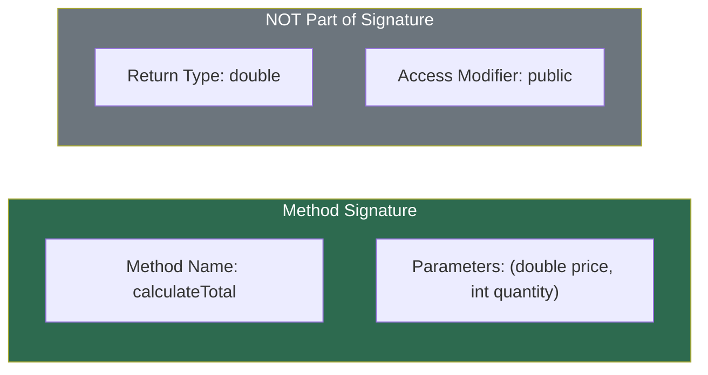
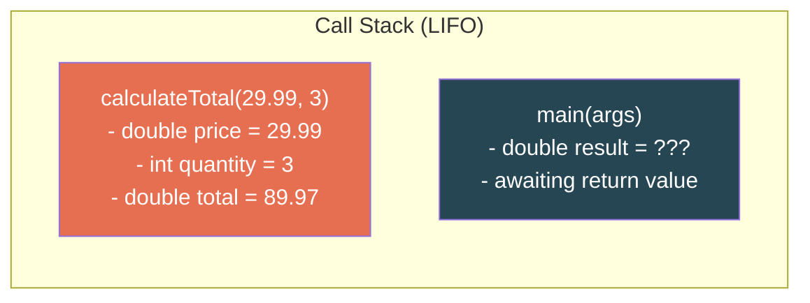
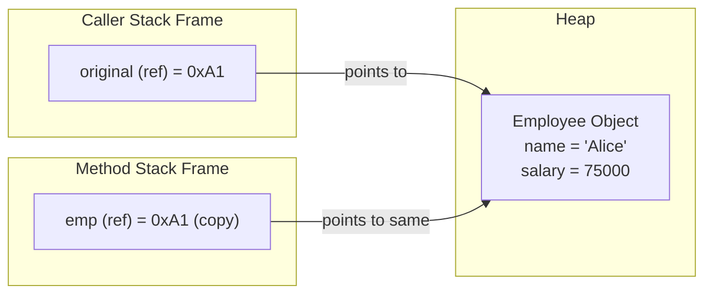
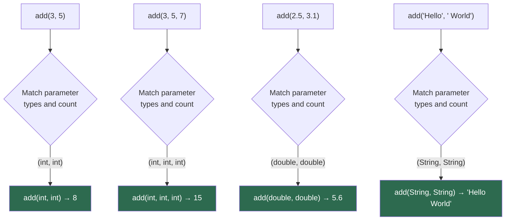
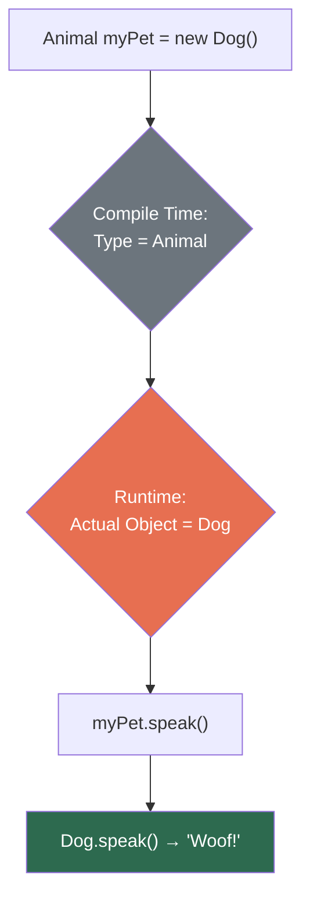
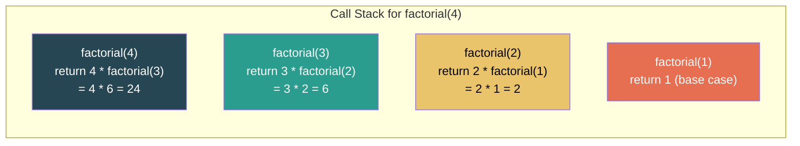

# Module 04: About Methods

[Previous: Arrays and Strings](03_arrays_strings.md) | [Back to Index](README.md) | [Next: OOP Basics](05_oop_basics.md)

---

## 4.1 What Is a Method?

A **method** is a named, reusable block of code that performs a specific task. Methods are the fundamental unit of behavior in Java. Every executable statement in Java lives inside a method, and the entry point of every application is the `main` method.

Methods provide three essential engineering benefits:
- **Modularity**: Breaking complex logic into small, testable units.
- **Reusability**: Writing logic once and calling it from many locations.
- **Abstraction**: Hiding implementation details behind a descriptive name.

---

## 4.2 Method Anatomy and Creation

Every method in Java follows a precise structural format:

```java
accessModifier returnType methodName(parameterList) {
    // Method body: the executable logic
    return value; // Required if returnType is not void
}
```

### 4.2.1 Component Breakdown

| Component | Purpose | Example |
|-----------|---------|---------|
| Access Modifier | Controls visibility (`public`, `private`, `protected`, default) | `public` |
| Return Type | The data type of the value returned, or `void` for no return | `int`, `String`, `void` |
| Method Name | Identifier following camelCase convention | `calculateTotal` |
| Parameter List | Comma-separated typed inputs (can be empty) | `(int a, double b)` |
| Method Body | The block of statements executed when the method is called | `{ return a + b; }` |

### 4.2.2 Method Signature

The **method signature** consists of the method name and its parameter list (types and order). The return type is **not** part of the signature. The compiler uses the signature to uniquely identify a method within a class.



### 4.2.3 Creating a Basic Method

```java
public static double calculateTotal(double price, int quantity) {
    double total = price * quantity;
    return total;
}
```

- `public static` — accessible without an object; belongs to the class.
- `double` — the method returns a `double` value.
- `calculateTotal` — descriptive, camelCase name.
- `(double price, int quantity)` — two parameters with explicit types.

---

## 4.3 Calling a Method

A method executes only when it is **called** (invoked). The caller provides **arguments** — actual values that map to the method's declared parameters.

### 4.3.1 Call Flow

```java
public static void main(String[] args) {
    double result = calculateTotal(29.99, 3);  // Arguments: 29.99 and 3
    System.out.println("Total: $" + result);   // Output: Total: $89.97
}
```

### 4.3.2 Method Call Stack Mechanics

Each method call creates a new **stack frame** on the call stack. The frame stores the method's parameters and local variables. When the method returns, its frame is destroyed.



When `calculateTotal` returns `89.97`, its frame is popped and `result` in `main` receives the value.

---

## 4.4 Parameters and Arguments

**Parameters** are the variables declared in the method definition. **Arguments** are the actual values passed during the method call.

### 4.4.1 Parameter Types

```java
// Multiple parameters with different types
public static String formatEmployee(String name, int id, double salary) {
    return "ID: " + id + " | Name: " + name + " | Salary: $" + salary;
}

// No parameters
public static void printSeparator() {
    System.out.println("================================");
}
```

### 4.4.2 Pass-by-Value Semantics

Java is **strictly pass-by-value**. When a method is called, the JVM copies the value of each argument into the corresponding parameter. This has critical implications:

**Primitive types**: The method receives a copy of the value. Changes to the parameter inside the method do not affect the original variable.

```java
public static void tryToModify(int x) {
    x = 999;  // Modifies the local copy only
}

int original = 42;
tryToModify(original);
System.out.println(original); // Still 42
```

**Reference types**: The method receives a copy of the reference (memory address). Both the original and the copy point to the same object on the heap — so the object's fields can be modified. However, reassigning the reference inside the method does not affect the caller's reference.

```java
public static void giveRaise(Employee emp) {
    emp.setSalary(100000.0);  // Modifies the shared heap object
}

public static void tryToReplace(Employee emp) {
    emp = new Employee("New");  // Reassigns the local copy; original is unaffected
}
```

### 4.4.3 Pass-by-Value Diagram



---

## 4.5 Return Types and the void Keyword

### 4.5.1 Returning Values

A method's return type declares the type of data it sends back to the caller. The `return` statement terminates the method and provides the value.

```java
public static int add(int a, int b) {
    return a + b;    // Returns an int value to the caller
}

public static boolean isAdult(int age) {
    return age >= 18;  // Returns a boolean
}
```

### 4.5.2 The void Return Type

Methods declared `void` perform an action but return no value. They may optionally use `return;` (with no value) to exit early.

```java
public static void greet(String name) {
    if (name == null) {
        return;  // Early exit; no value returned
    }
    System.out.println("Hello, " + name + "!");
}
```

### 4.5.3 Multiple Return Paths

A method can have multiple `return` statements, but every possible execution path must return a value (for non-void methods), or the compiler will produce an error.

```java
public static String classify(int score) {
    if (score >= 90) return "Excellent";
    if (score >= 70) return "Good";
    if (score >= 50) return "Average";
    return "Below Average";  // Ensures all paths return a value
}
```

---

## 4.6 Method Overloading

**Method overloading** allows a class to define multiple methods with the **same name** but **different parameter lists** (different number, types, or order of parameters). The compiler resolves which version to call based on the arguments at the call site.

### 4.6.1 Overloading Rules

1. Methods **must** differ in their parameter list (the method signature).
2. Return type alone is **not** sufficient to distinguish overloaded methods.
3. Access modifiers can differ, but do not contribute to overloading.

### 4.6.2 Overloading Examples

```java
public class MathHelper {

    // Version 1: two integers
    public static int add(int a, int b) {
        return a + b;
    }

    // Version 2: three integers (different number of parameters)
    public static int add(int a, int b, int c) {
        return a + b + c;
    }

    // Version 3: two doubles (different parameter types)
    public static double add(double a, double b) {
        return a + b;
    }

    // Version 4: String concatenation (different parameter types entirely)
    public static String add(String a, String b) {
        return a + b;
    }
}
```

### 4.6.3 Compiler Resolution Flow



### 4.6.4 Type Promotion in Overloading

When no exact match is found, Java performs **automatic type promotion** (widening) to find a compatible overloaded method:

`byte` → `short` → `int` → `long` → `float` → `double`

```java
public static void display(double value) {
    System.out.println("double: " + value);
}

display(42);     // int 42 is promoted to double 42.0
display(3.14f);  // float is promoted to double
```

---

## 4.7 Method Overriding

**Method overriding** occurs when a subclass provides its own implementation of a method that is already defined in its superclass. The overriding method must have the **same signature and return type** (or a covariant return type) as the method it replaces.

### 4.7.1 Overriding Rules

| Rule | Requirement |
|------|-------------|
| Method Signature | Must be identical (same name, same parameter list) |
| Return Type | Must be the same or a subtype (covariant return) |
| Access Modifier | Must be the same or less restrictive |
| Exceptions | Cannot throw broader checked exceptions |
| `@Override` Annotation | Not required, but strongly recommended for compiler safety |

### 4.7.2 Overriding Example

```java
class Animal {
    public String speak() {
        return "Some generic sound";
    }
}

class Dog extends Animal {
    @Override
    public String speak() {
        return "Woof!";  // Replaces the parent implementation
    }
}

class Cat extends Animal {
    @Override
    public String speak() {
        return "Meow!";  // Each subclass provides its own behavior
    }
}
```

### 4.7.3 Runtime Polymorphism

Overriding enables **runtime polymorphism** (dynamic dispatch). The JVM determines which version of the method to call based on the **actual object type** at runtime, not the reference type at compile time.

```java
Animal myPet = new Dog();   // Reference type: Animal; Object type: Dog
System.out.println(myPet.speak());  // Output: "Woof!" (Dog's version is called)
```



---

## 4.8 Overloading vs. Overriding

These two concepts are frequently confused. The following table clarifies the distinctions:

| Aspect | Overloading | Overriding |
|--------|-------------|------------|
| Where | Same class (or inherited) | Subclass redefines superclass method |
| Parameters | Must differ | Must be identical |
| Return Type | Can differ | Must be same or covariant |
| Resolution | Compile-time (static binding) | Runtime (dynamic dispatch) |
| `@Override` | Not applicable | Recommended |
| `static` methods | Can be overloaded | Cannot be overridden (hidden instead) |

---

## 4.9 Variable Arguments (Varargs)

Java supports **variable-length argument lists** using the `...` syntax. A varargs parameter is treated as an array inside the method.

### 4.9.1 Varargs Rules

- Only **one** varargs parameter is allowed per method.
- It must be the **last** parameter in the list.
- The compiler wraps the arguments into an array automatically.

```java
public static int sum(int... numbers) {
    int total = 0;
    for (int num : numbers) {
        total += num;
    }
    return total;
}

// All of these calls are valid:
sum(1, 2);            // 3
sum(1, 2, 3, 4, 5);  // 15
sum();                // 0 (empty array)
```

### 4.9.2 Varargs with Other Parameters

```java
public static void log(String level, String... messages) {
    for (String msg : messages) {
        System.out.println("[" + level + "] " + msg);
    }
}

log("INFO", "Server started", "Listening on port 8080");
```

---

## 4.10 Recursion

A **recursive method** is a method that calls itself. Every recursive solution requires two components:

1. **Base case**: A condition that stops the recursion.
2. **Recursive case**: The method calls itself with a smaller or simpler input.

### 4.10.1 Factorial Example

```java
public static long factorial(int n) {
    if (n <= 1) {
        return 1;           // Base case: factorial(0) = factorial(1) = 1
    }
    return n * factorial(n - 1);  // Recursive case: n * (n-1)!
}
```

### 4.10.2 Recursion Call Stack



**Warning**: Without a proper base case, recursion produces a `StackOverflowError` as stack frames accumulate without bound.

---

## 4.11 Static Methods vs. Instance Methods

| Aspect | Static Method | Instance Method |
|--------|--------------|-----------------|
| Declaration | Uses `static` keyword | No `static` keyword |
| Invocation | Called on the class: `ClassName.method()` | Called on an object: `object.method()` |
| Access to `this` | No (no instance context) | Yes |
| Can access instance fields | No | Yes |
| Can access static fields | Yes | Yes |
| Use case | Utility functions, `main`, factory methods | Operations on object state |

```java
public class StringUtils {

    // Static: does not depend on any object state
    public static boolean isEmpty(String str) {
        return str == null || str.trim().length() == 0;
    }
}

// Called without creating an object:
boolean result = StringUtils.isEmpty("  ");  // true
```

---

## 4.12 Method Design Best Practices

| Principle | Guideline |
|-----------|-----------|
| Single Responsibility | Each method should do exactly one thing |
| Descriptive Naming | Method names should describe the action: `calculateTax`, not `calc` |
| Parameter Count | Limit to 3-4 parameters; use objects for more |
| Side Effects | Minimize unexpected side effects; document them when unavoidable |
| Return vs. Print | Methods should return data, not print it (separation of concerns) |
| Method Length | If a method exceeds 20-30 lines, consider splitting it |

---

## Code in Practice

```java
/**
 * Module 04: About Methods - Code in Practice
 * Demonstrates method creation, parameters, calling, overloading,
 * overriding, varargs, and recursion.
 */
public class MethodsDemo {

    public static void main(String[] args) {

        // --- Section 1: Basic Method Creation and Calling ---
        // A method encapsulates logic and is invoked by name with arguments.
        System.out.println("--- Basic Methods ---");
        double total = calculateTotal(29.99, 3);
        System.out.println("Total: $" + total);   // 89.97

        printSeparator();  // void method: performs action, returns nothing

        // --- Section 2: Pass-by-Value with Primitives ---
        // Java copies the value; the original variable is never modified.
        System.out.println("--- Pass-by-Value (Primitive) ---");
        int original = 42;
        tryToModify(original);
        System.out.println("After tryToModify: " + original);  // Still 42

        printSeparator();

        // --- Section 3: Multiple Return Paths ---
        System.out.println("--- Multiple Return Paths ---");
        System.out.println("Score 95: " + classify(95));   // Excellent
        System.out.println("Score 72: " + classify(72));   // Good
        System.out.println("Score 45: " + classify(45));   // Below Average

        printSeparator();

        // --- Section 4: Method Overloading ---
        // The compiler selects the method based on the argument types and count.
        System.out.println("--- Method Overloading ---");
        System.out.println("add(3, 5):            " + add(3, 5));             // int version
        System.out.println("add(3, 5, 7):          " + add(3, 5, 7));         // three-int version
        System.out.println("add(2.5, 3.1):         " + add(2.5, 3.1));       // double version
        System.out.println("add(\"Hello\", \" World\"): " + add("Hello", " World")); // String version

        printSeparator();

        // --- Section 5: Method Overriding (Runtime Polymorphism) ---
        // The JVM calls the method based on the actual object type, not the reference type.
        System.out.println("--- Method Overriding ---");
        Animal genericAnimal = new Animal();
        Animal myDog = new Dog();    // Reference: Animal, Object: Dog
        Animal myCat = new Cat();    // Reference: Animal, Object: Cat

        System.out.println("Animal: " + genericAnimal.speak());  // "Some generic sound"
        System.out.println("Dog:    " + myDog.speak());           // "Woof!"
        System.out.println("Cat:    " + myCat.speak());           // "Meow!"

        printSeparator();

        // --- Section 6: Varargs ---
        // Variable arguments are treated as an array inside the method.
        System.out.println("--- Varargs ---");
        System.out.println("sum():            " + sum());                // 0
        System.out.println("sum(1, 2):        " + sum(1, 2));            // 3
        System.out.println("sum(1, 2, 3, 4):  " + sum(1, 2, 3, 4));    // 10

        log("INFO", "Server started", "Listening on port 8080");

        printSeparator();

        // --- Section 7: Recursion ---
        // Each recursive call pushes a new frame onto the call stack until the base case.
        System.out.println("--- Recursion ---");
        System.out.println("factorial(5): " + factorial(5));   // 120
        System.out.println("factorial(0): " + factorial(0));   // 1

        System.out.println("fibonacci(7): " + fibonacci(7));   // 13

        printSeparator();

        // --- Section 8: Static vs. Instance Methods ---
        // Static methods are called on the class; instance methods require an object.
        System.out.println("--- Static vs. Instance ---");
        System.out.println("isEmpty(null):   " + StringUtils.isEmpty(null));    // true
        System.out.println("isEmpty('Java'): " + StringUtils.isEmpty("Java")); // false

        Counter c1 = new Counter();
        c1.increment();  // Instance method: modifies this object's state
        c1.increment();
        c1.increment();
        System.out.println("Counter value: " + c1.getValue());  // 3
    }

    // =====================================================================
    // Basic Method: calculates total price
    // =====================================================================
    public static double calculateTotal(double price, int quantity) {
        double total = price * quantity;  // Local variable on the stack frame
        return total;                     // Value returned; frame destroyed
    }

    // =====================================================================
    // Void Method: prints a visual separator
    // =====================================================================
    public static void printSeparator() {
        System.out.println("================================");
    }

    // =====================================================================
    // Pass-by-Value Demo: modifying a parameter has no effect on the caller
    // =====================================================================
    public static void tryToModify(int x) {
        x = 999;  // Only the local copy is changed
        System.out.println("Inside method: x = " + x);  // 999
    }

    // =====================================================================
    // Multiple Return Paths: every execution path returns a value
    // =====================================================================
    public static String classify(int score) {
        if (score >= 90) return "Excellent";
        if (score >= 70) return "Good";
        if (score >= 50) return "Average";
        return "Below Average";  // Default path
    }

    // =====================================================================
    // Method Overloading: same name, different parameter lists
    // =====================================================================
    public static int add(int a, int b) {
        return a + b;
    }

    public static int add(int a, int b, int c) {
        return a + b + c;
    }

    public static double add(double a, double b) {
        return a + b;
    }

    public static String add(String a, String b) {
        return a + b;
    }

    // =====================================================================
    // Varargs: accepts a variable number of arguments
    // =====================================================================
    public static int sum(int... numbers) {
        int total = 0;
        for (int num : numbers) {
            total += num;          // Iterates over the implicit array
        }
        return total;
    }

    public static void log(String level, String... messages) {
        for (String msg : messages) {
            System.out.println("[" + level + "] " + msg);
        }
    }

    // =====================================================================
    // Recursion: factorial with base case
    // =====================================================================
    public static long factorial(int n) {
        if (n <= 1) return 1;               // Base case
        return n * factorial(n - 1);         // Recursive case
    }

    // =====================================================================
    // Recursion: Fibonacci sequence
    // =====================================================================
    public static int fibonacci(int n) {
        if (n <= 0) return 0;               // Base case 1
        if (n == 1) return 1;               // Base case 2
        return fibonacci(n - 1) + fibonacci(n - 2);  // Two recursive calls
    }
}

// =========================================================================
// Animal Hierarchy: demonstrates method overriding
// =========================================================================
class Animal {
    public String speak() {
        return "Some generic sound";
    }
}

class Dog extends Animal {
    @Override
    public String speak() {
        return "Woof!";    // Overrides parent implementation
    }
}

class Cat extends Animal {
    @Override
    public String speak() {
        return "Meow!";   // Each subclass provides unique behavior
    }
}

// =========================================================================
// StringUtils: demonstrates static utility methods
// =========================================================================
class StringUtils {
    public static boolean isEmpty(String str) {
        return str == null || str.trim().length() == 0;
    }
}

// =========================================================================
// Counter: demonstrates instance methods operating on object state
// =========================================================================
class Counter {
    private int count = 0;

    public void increment() {
        this.count++;    // Modifies this object's state
    }

    public int getValue() {
        return this.count;
    }
}
```

---

[Previous: Arrays and Strings](03_arrays_strings.md) | [Back to Index](README.md) | [Next: OOP Basics](05_oop_basics.md)
