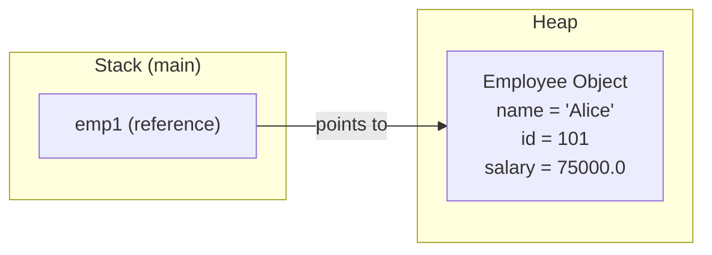
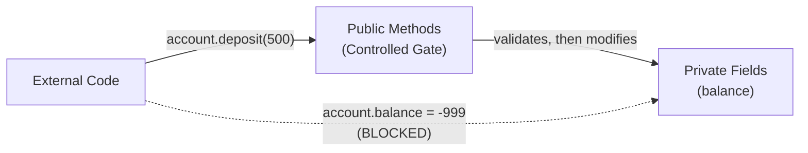
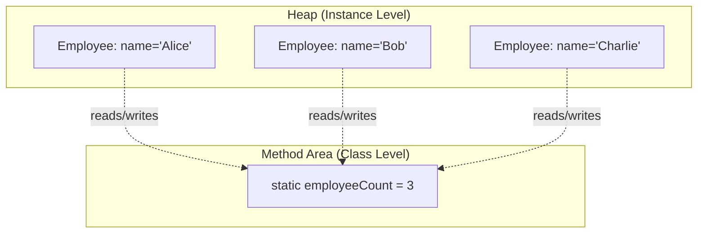

# Module 04: OOP Basics

[Previous: Arrays and Strings](03_arrays_strings.md) | [Back to Index](README.md) | [Next: Advanced OOP](05_advanced_oop.md)

---

## 4.1 Class vs. Object

A **class** is a blueprint that defines the structure (fields) and behavior (methods) of a type. An **object** is a concrete instance of a class, allocated on the heap at runtime.

### 4.1.1 Anatomy of a Class

```java
public class Employee {
    // Fields (instance variables) -- define the state of each object
    private String name;
    private int id;
    private double salary;

    // Constructor -- initializes the object when created with 'new'
    public Employee(String name, int id, double salary) {
        this.name = name;
        this.id = id;
        this.salary = salary;
    }

    // Methods -- define the behavior of the object
    public String getName() {
        return this.name;
    }
}
```

### 4.1.2 Object Creation and Memory

When `new Employee("Alice", 101, 75000)` is called:
1. Memory is allocated on the **heap** for the object's fields.
2. The constructor is invoked to initialize those fields.
3. A **reference** to the heap object is returned and stored on the stack.



---

## 4.2 Constructors and the this Keyword

A **constructor** is a special method that shares the class name and has no return type. It is invoked exactly once when an object is created.

### 4.2.1 Constructor Types

**Default Constructor**: If no constructor is defined, Java provides a no-argument constructor that initializes fields to their default values.

**Parameterized Constructor**: Accepts arguments to initialize fields with specific values.

**Constructor Overloading**: A class can define multiple constructors with different parameter lists.

### 4.2.2 The this Keyword

`this` refers to the current object instance. It is used to:
- Disambiguate between instance fields and constructor/method parameters.
- Call one constructor from another (constructor chaining).

```java
public class Product {
    private String name;
    private double price;

    // Constructor chaining: this() must be the first statement
    public Product(String name) {
        this(name, 0.0);  // Delegates to the two-argument constructor
    }

    public Product(String name, double price) {
        this.name = name;    // 'this.name' is the field; 'name' is the parameter
        this.price = price;
    }
}
```

---

## 4.3 Access Modifiers and Encapsulation

Access modifiers control the visibility of classes, fields, and methods. They are the mechanism for **encapsulation** -- hiding internal state and exposing only a controlled interface.

### 4.3.1 Modifier Visibility Table

| Modifier | Same Class | Same Package | Subclass | World |
|----------|-----------|-------------|----------|-------|
| `private` | Yes | No | No | No |
| (default) | Yes | Yes | No | No |
| `protected` | Yes | Yes | Yes | No |
| `public` | Yes | Yes | Yes | Yes |

### 4.3.2 Encapsulation Pattern

The standard encapsulation pattern in Java uses `private` fields with `public` getter and setter methods:

```java
public class BankAccount {
    private double balance;  // Hidden from external access

    public double getBalance() {
        return this.balance;           // Controlled read access
    }

    public void deposit(double amount) {
        if (amount > 0) {              // Validation before mutation
            this.balance += amount;
        }
    }
}
```

### 4.3.3 Why Encapsulation Matters



Without encapsulation, any code could set `balance` to an invalid value like `-999`. With encapsulation, the `deposit()` method enforces validation rules.

---

## 4.4 The static Keyword

The `static` keyword associates a member with the **class itself** rather than with any particular instance.

### 4.4.1 Static Fields

A `static` field is shared across all instances of a class. There is only one copy, stored in the **method area** of the JVM (not on the heap with individual objects).

```java
public class Employee {
    private static int employeeCount = 0;  // Shared across all instances
    private String name;

    public Employee(String name) {
        this.name = name;
        employeeCount++;  // Incremented by every constructor call
    }

    public static int getEmployeeCount() {
        return employeeCount;
    }
}
```

### 4.4.2 Static vs. Instance Memory



### 4.4.3 Rules for static Members

- Static methods can access only static fields and other static methods.
- Static methods cannot use `this` (there is no instance context).
- Instance methods can access both static and instance members.

---

## 4.5 The final Keyword

The `final` keyword enforces immutability at different levels:

| Applied To | Effect |
|-----------|--------|
| Variable | Cannot be reassigned after initialization (constant) |
| Method | Cannot be overridden by subclasses |
| Class | Cannot be extended (no subclasses) |

```java
final double TAX_RATE = 0.07;     // Constant; naming convention: UPPER_SNAKE_CASE
// TAX_RATE = 0.08;               // Compilation error: cannot reassign
```

**Note**: For reference types, `final` prevents reassignment of the reference, not modification of the object itself.

```java
final int[] arr = {1, 2, 3};
arr[0] = 99;                      // Allowed: modifying the object's contents
// arr = new int[]{4, 5, 6};      // Error: reassigning the reference
```

---

## Code in Practice

```java
/**
 * Module 04: OOP Basics - Code in Practice
 * Demonstrates classes, constructors, encapsulation, static, and final.
 */
public class OopBasicsDemo {

    public static void main(String[] args) {

        // --- Section 1: Object Creation ---
        // 'new' allocates heap memory and invokes the constructor.
        Employee emp1 = new Employee("Alice", 101, 85000.0);
        Employee emp2 = new Employee("Bob", 102, 72000.0);
        Employee emp3 = new Employee("Charlie", 103);  // Uses overloaded constructor

        System.out.println("--- Employee Objects ---");
        System.out.println(emp1.getSummary());
        System.out.println(emp2.getSummary());
        System.out.println(emp3.getSummary());

        // --- Section 2: Static Field ---
        // employeeCount is shared across all instances; reflects total objects created.
        System.out.println("\nTotal Employees: " + Employee.getEmployeeCount());

        // --- Section 3: Encapsulation ---
        // Direct field access is blocked; must use the public setter with validation.
        emp1.setSalary(90000.0);   // Valid: positive amount
        emp1.setSalary(-5000.0);   // Rejected: setter enforces validation
        System.out.println("\nUpdated Salary: " + emp1.getSalary());

        // --- Section 4: Final variable ---
        final String COMPANY_NAME = "TechCorp";
        System.out.println("\nCompany: " + COMPANY_NAME);
        // COMPANY_NAME = "OtherCorp"; // Would cause a compilation error
    }
}

/**
 * Encapsulated Employee class demonstrating constructors, this keyword,
 * access modifiers, static fields, and final constants.
 */
class Employee {

    // --- Static field: belongs to the class, not any instance ---
    private static int employeeCount = 0;

    // --- Final constant: immutable after initialization ---
    private static final String DEFAULT_DEPARTMENT = "Unassigned";

    // --- Instance fields: private for encapsulation ---
    private String name;
    private int id;
    private double salary;
    private String department;

    // --- Parameterized Constructor (full) ---
    public Employee(String name, int id, double salary) {
        this.name = name;         // 'this' disambiguates field from parameter
        this.id = id;
        this.salary = salary;
        this.department = DEFAULT_DEPARTMENT;
        employeeCount++;          // Increment the class-level counter
    }

    // --- Overloaded Constructor (partial) ---
    // Constructor chaining: delegates to the full constructor using this()
    public Employee(String name, int id) {
        this(name, id, 0.0);      // this() must be the first statement
    }

    // --- Getter: controlled read access ---
    public String getName() {
        return this.name;
    }

    public double getSalary() {
        return this.salary;
    }

    // --- Setter with validation: controlled write access ---
    public void setSalary(double salary) {
        if (salary > 0) {
            this.salary = salary;   // Only positive values are accepted
        } else {
            System.out.println("  [Warning] Invalid salary rejected: " + salary);
        }
    }

    // --- Instance method: operates on this object's state ---
    public String getSummary() {
        return "ID: " + this.id + " | Name: " + this.name
             + " | Salary: $" + this.salary
             + " | Dept: " + this.department;
    }

    // --- Static method: accesses only static members ---
    public static int getEmployeeCount() {
        return employeeCount;
    }
}
```

---

[Previous: Arrays and Strings](03_arrays_strings.md) | [Back to Index](README.md) | [Next: Advanced OOP](05_advanced_oop.md)
