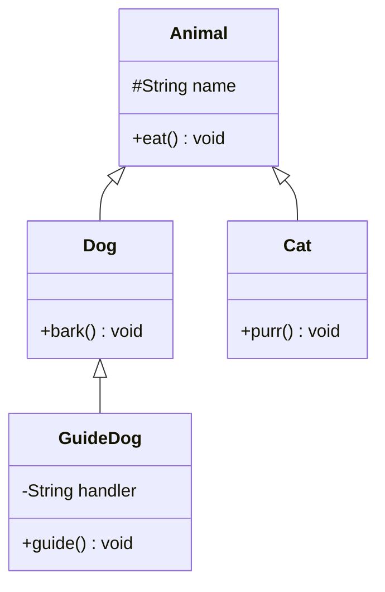
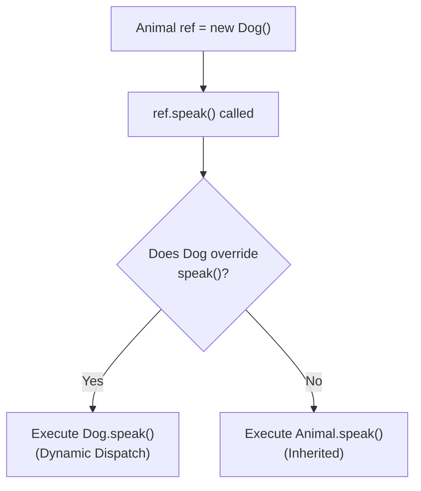
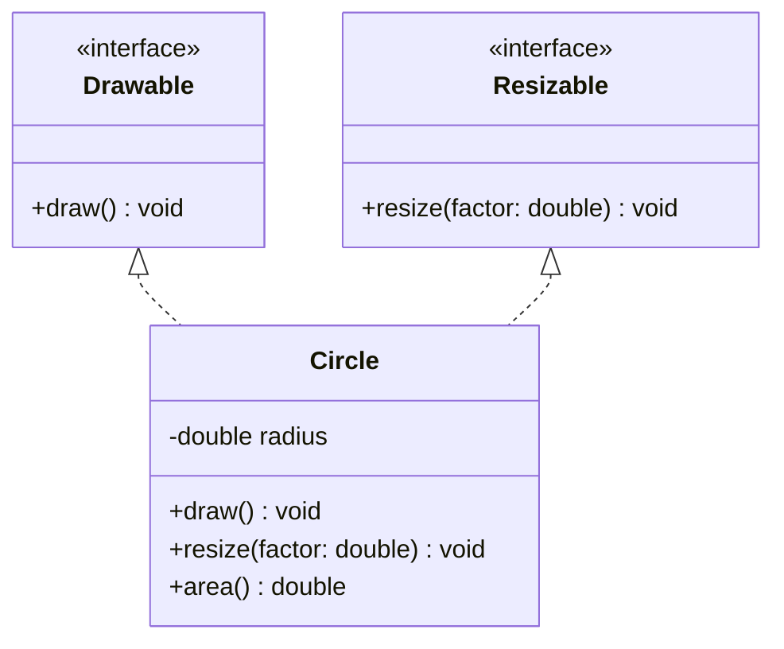

# Module 05: Advanced OOP

[Previous: OOP Basics](04_oop_basics.md) | [Back to Index](README.md) | [Next: Collections and Generics](06_collections_generics.md)

---

## 5.1 Inheritance

Inheritance allows a new class (subclass) to acquire the fields and methods of an existing class (superclass). It models an "is-a" relationship and promotes code reuse.

### 5.1.1 Syntax and Mechanics

```java
public class Animal {               // Superclass (parent)
    protected String name;

    public void eat() {
        System.out.println(name + " is eating.");
    }
}

public class Dog extends Animal {   // Subclass (child) inherits from Animal
    public void bark() {
        System.out.println(name + " is barking.");
    }
}
```

The `extends` keyword establishes the inheritance relationship. A subclass inherits all non-private members of its superclass.

### 5.1.2 The super Keyword

`super` refers to the immediate parent class. It is used to:
- Call the parent constructor: `super(args)` (must be the first statement in the child constructor).
- Access a parent method that has been overridden: `super.methodName()`.

### 5.1.3 Inheritance Hierarchy Diagram



### 5.1.4 Single Inheritance Rule

Java supports only **single inheritance** for classes. A class can extend exactly one superclass. This avoids the diamond problem found in languages like C++ that allow multiple inheritance.

---

## 5.2 Method Overriding

Method overriding occurs when a subclass provides its own implementation of a method that is already defined in its superclass. The method signature (name, parameters, return type) must be identical.

### 5.2.1 Rules for Overriding

- The overriding method must have the same signature as the parent method.
- The access modifier can be the same or less restrictive (e.g., `protected` to `public`).
- The `@Override` annotation is optional but strongly recommended; it enables compile-time verification.
- `private`, `static`, and `final` methods cannot be overridden.

```java
public class Animal {
    public String speak() {
        return "...";
    }
}

public class Dog extends Animal {
    @Override
    public String speak() {
        return "Woof!";  // Subclass-specific behavior
    }
}
```

---

## 5.3 Polymorphism

Polymorphism ("many forms") allows a superclass reference to point to a subclass object. The JVM determines which method implementation to call at **runtime**, not at compile time. This is called **dynamic method dispatch**.

### 5.3.1 How It Works

```java
Animal myAnimal = new Dog();   // Superclass reference, subclass object
myAnimal.eat();                // Calls Animal.eat() (inherited)
myAnimal.speak();              // Calls Dog.speak() (overridden -- resolved at runtime)
// myAnimal.bark();            // Compilation error: Animal has no bark() method
```

### 5.3.2 Polymorphism Resolution Flow



### 5.3.3 Practical Value

Polymorphism enables writing code that operates on the superclass type while automatically adapting to the specific subclass at runtime. This is the foundation of the **Open/Closed Principle**: software entities should be open for extension but closed for modification.

```java
// This method works with ANY Animal subclass, present or future
public void makeAllSpeak(Animal[] animals) {
    for (Animal a : animals) {
        System.out.println(a.speak()); // Correct subclass method called automatically
    }
}
```

---

## 5.4 Abstract Classes

An **abstract class** is a class that cannot be instantiated directly. It serves as a partial implementation that subclasses must complete.

### 5.4.1 Key Characteristics

- Declared with the `abstract` keyword.
- Can contain both abstract methods (no body) and concrete methods (with body).
- Can have constructors, fields, and static methods.
- A subclass must implement all abstract methods or itself be declared abstract.

```java
public abstract class Shape {
    protected String color;

    public Shape(String color) {
        this.color = color;
    }

    // Abstract method: no implementation; subclasses MUST override
    public abstract double area();

    // Concrete method: shared behavior inherited by all subclasses
    public String describe() {
        return color + " shape with area " + area();
    }
}
```

---

## 5.5 Interfaces

An **interface** defines a contract of behavior that implementing classes must fulfill. Unlike abstract classes, interfaces support **multiple implementation**, allowing a class to adopt behaviors from multiple sources.

### 5.5.1 Interface Syntax

```java
public interface Drawable {
    void draw();    // Implicitly public and abstract

    // Default method (Java 8+): provides a default implementation
    default void erase() {
        System.out.println("Erasing drawing.");
    }

    // Static method: utility method belonging to the interface
    static String getFormat() {
        return "SVG";
    }
}
```

### 5.5.2 Abstract Class vs. Interface

| Feature | Abstract Class | Interface |
|---------|---------------|-----------|
| Instantiation | Cannot be instantiated | Cannot be instantiated |
| Methods | Abstract + concrete | Abstract + default + static |
| Fields | Any type | Only `public static final` |
| Constructors | Yes | No |
| Multiple Inheritance | Single only | Multiple allowed |
| Use Case | Shared state + partial behavior | Pure behavior contract |

### 5.5.3 Multiple Interface Implementation



---

## Code in Practice

```java
/**
 * Module 05: Advanced OOP - Code in Practice
 * Demonstrates inheritance, method overriding, polymorphism,
 * abstract classes, and interface implementation.
 */
public class AdvancedOopDemo {

    public static void main(String[] args) {

        // --- Section 1: Polymorphism with abstract class ---
        // Superclass reference can hold any subclass object.
        Shape circle = new Circle("Red", 5.0);
        Shape rectangle = new Rectangle("Blue", 4.0, 6.0);

        System.out.println("--- Polymorphic Shape Descriptions ---");
        System.out.println(circle.describe());      // Calls Circle.area() via dynamic dispatch
        System.out.println(rectangle.describe());    // Calls Rectangle.area()

        // --- Section 2: Array of polymorphic objects ---
        // One array type, multiple behaviors at runtime.
        Shape[] shapes = { circle, rectangle, new Circle("Green", 3.0) };
        System.out.println("\n--- All Shape Areas ---");
        for (Shape s : shapes) {
            System.out.printf("  %s area: %.2f%n", s.getClass().getSimpleName(), s.area());
        }

        // --- Section 3: Interface usage ---
        // Circle implements Drawable; we can use the interface type.
        Drawable drawable = (Drawable) circle;  // Safe because Circle implements Drawable
        System.out.println("\n--- Drawable Interface ---");
        drawable.draw();
        drawable.erase();   // Uses the default method from the interface

        // --- Section 4: Static interface method ---
        System.out.println("Drawing format: " + Drawable.getFormat());
    }
}

// --- Abstract Class: Shape ---
abstract class Shape {
    protected String color;

    // Abstract classes CAN have constructors; called via super() in subclasses.
    public Shape(String color) {
        this.color = color;
    }

    // Abstract method: each subclass must provide its own formula.
    public abstract double area();

    // Concrete method: shared logic that uses the abstract method.
    public String describe() {
        return String.format("%s %s | Area: %.2f",
            color, this.getClass().getSimpleName(), area());
    }
}

// --- Interface: Drawable ---
interface Drawable {
    void draw();   // Abstract by default

    // Default method: subclasses may override, but are not required to.
    default void erase() {
        System.out.println("  Erasing drawing...");
    }

    // Static utility method: accessed via Drawable.getFormat()
    static String getFormat() {
        return "SVG";
    }
}

// --- Concrete Class: Circle ---
// Extends Shape (abstract class) AND implements Drawable (interface).
class Circle extends Shape implements Drawable {
    private double radius;

    public Circle(String color, double radius) {
        super(color);           // Calls Shape(String color)
        this.radius = radius;
    }

    @Override
    public double area() {
        return Math.PI * radius * radius;  // Pi * r^2
    }

    @Override
    public void draw() {
        System.out.println("  Drawing " + color + " circle with radius " + radius);
    }
}

// --- Concrete Class: Rectangle ---
class Rectangle extends Shape {
    private double width;
    private double height;

    public Rectangle(String color, double width, double height) {
        super(color);
        this.width = width;
        this.height = height;
    }

    @Override
    public double area() {
        return width * height;  // Width * Height
    }
}
```

---

[Previous: OOP Basics](04_oop_basics.md) | [Back to Index](README.md) | [Next: Collections and Generics](06_collections_generics.md)
