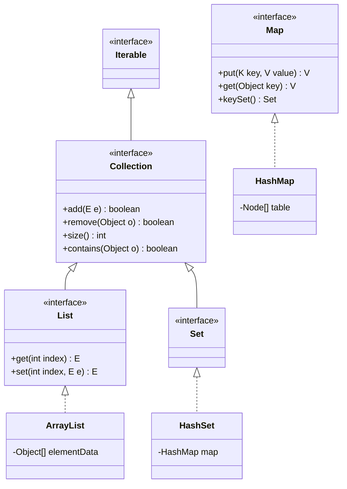
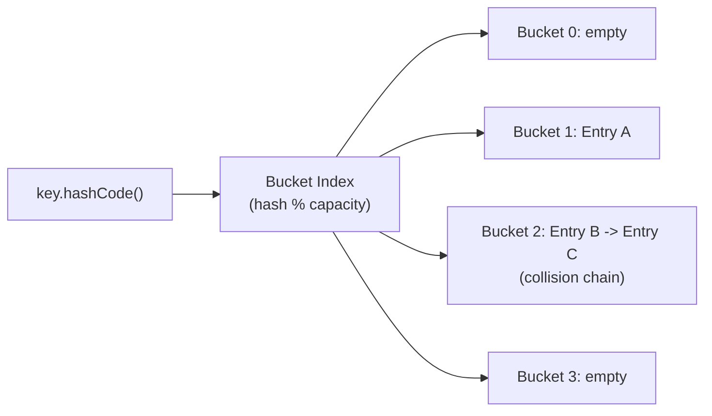

# Module 07: Collections and Generics

[Previous: Advanced OOP](06_advanced_oop.md) | [Back to Index](README.md) | [Next: JDBC Persistence](08_jdbc_persistence.md)

---

## 7.1 The Collections Framework

Java's Collections Framework provides a unified architecture for storing, retrieving, and manipulating groups of objects. Unlike arrays, collections are dynamically sized.

### 7.1.1 Core Interface Hierarchy



---

## 7.2 ArrayList

`ArrayList` is a resizable array implementation of the `List` interface. It provides O(1) random access by index and amortized O(1) appends.

### 7.2.1 Key Characteristics

- Maintains insertion order.
- Allows duplicate elements.
- Allows `null` elements.
- Not thread-safe (use `Collections.synchronizedList()` or `CopyOnWriteArrayList` for concurrency).
- Backed by an internal array that resizes (typically by 50%) when capacity is exceeded.

### 7.2.2 Essential Operations

| Operation | Method | Time Complexity |
|-----------|--------|----------------|
| Add to end | `add(E e)` | O(1) amortized |
| Add at index | `add(int i, E e)` | O(n) |
| Get by index | `get(int i)` | O(1) |
| Remove by index | `remove(int i)` | O(n) |
| Search | `contains(Object o)` | O(n) |
| Size | `size()` | O(1) |

---

## 7.3 HashMap

`HashMap` stores data as key-value pairs. Keys must be unique; values can be duplicated. It provides O(1) average-case lookup, insertion, and deletion.

### 7.3.1 How Hashing Works

1. The `hashCode()` method of the key produces an integer hash.
2. The hash is mapped to a bucket index in the internal array.
3. If two keys map to the same bucket (collision), they are stored in a linked list or balanced tree (Java 8+) within that bucket.



### 7.3.2 Key Requirement

For `HashMap` to function correctly, keys must properly implement both `hashCode()` and `equals()`. If two objects are `equals()`, they must produce the same `hashCode()`.

---

## 7.4 HashSet

`HashSet` stores unique elements with no guaranteed order. Internally, it is backed by a `HashMap` where elements are keys and values are a dummy constant.

### 7.4.1 Key Characteristics

- No duplicate elements (determined by `hashCode()` and `equals()`).
- No guaranteed iteration order.
- Allows one `null` element.
- O(1) average time for `add`, `remove`, and `contains`.

---

## 7.5 Generics

Generics enable **type-safe** collections and classes by parameterizing types at compile time, eliminating the need for unsafe casts.

### 7.5.1 Without Generics (Pre-Java 5)

```java
List rawList = new ArrayList();
rawList.add("Hello");
rawList.add(42);                          // No compile-time check
String s = (String) rawList.get(1);       // ClassCastException at runtime!
```

### 7.5.2 With Generics

```java
List<String> safeList = new ArrayList<>();
safeList.add("Hello");
// safeList.add(42);                      // Compilation error: type safety enforced
String s = safeList.get(0);               // No cast needed
```

### 7.5.3 Type Erasure

Generics are a compile-time feature. At runtime, generic type information is erased and replaced with `Object` (or the upper bound). This means:
- You cannot use `instanceof` with a generic type.
- You cannot create arrays of generic types.
- You cannot instantiate a generic type parameter with `new T()`.

### 7.5.4 Writing Generic Classes

```java
public class Pair<K, V> {
    private K key;
    private V value;

    public Pair(K key, V value) {
        this.key = key;
        this.value = value;
    }

    public K getKey()   { return key; }
    public V getValue() { return value; }
}
```

### 7.5.5 Bounded Type Parameters

```java
// T must be a subtype of Comparable<T>
public static <T extends Comparable<T>> T findMax(T a, T b) {
    return (a.compareTo(b) >= 0) ? a : b;
}
```

---

## Code in Practice

```java
import java.util.ArrayList;
import java.util.HashMap;
import java.util.HashSet;
import java.util.List;
import java.util.Map;
import java.util.Set;

/**
 * Module 07: Collections and Generics - Code in Practice
 * Demonstrates ArrayList, HashMap, HashSet, and generic type safety.
 */
public class CollectionsDemo {

    public static void main(String[] args) {

        // --- Section 1: ArrayList ---
        // A dynamically resizing list that maintains insertion order.
        List<String> languages = new ArrayList<>();
        languages.add("Java");        // Appends to end: O(1) amortized
        languages.add("Python");
        languages.add("C++");
        languages.add("JavaScript");

        System.out.println("--- ArrayList ---");
        System.out.println("Languages: " + languages);
        System.out.println("Element at index 1: " + languages.get(1)); // O(1) random access
        languages.remove("C++");      // Removes first occurrence; shifts elements: O(n)
        System.out.println("After removal: " + languages);
        System.out.println("Contains Java? " + languages.contains("Java"));

        // Enhanced for loop: iterates in insertion order
        System.out.println("Iterating:");
        for (String lang : languages) {
            System.out.println("  - " + lang);
        }

        // --- Section 2: HashMap ---
        // Stores key-value pairs with O(1) average lookup.
        Map<String, Integer> inventory = new HashMap<>();
        inventory.put("Laptop", 25);      // Associates key "Laptop" with value 25
        inventory.put("Mouse", 150);
        inventory.put("Keyboard", 75);
        inventory.put("Laptop", 30);      // Overwrites previous value for "Laptop"

        System.out.println("\n--- HashMap ---");
        System.out.println("Inventory: " + inventory);
        System.out.println("Laptops in stock: " + inventory.get("Laptop"));

        // getOrDefault prevents NullPointerException for missing keys
        int monitors = inventory.getOrDefault("Monitor", 0);
        System.out.println("Monitors (default 0): " + monitors);

        // Iterating over entries: each entry is a key-value pair
        System.out.println("All items:");
        for (Map.Entry<String, Integer> entry : inventory.entrySet()) {
            System.out.println("  " + entry.getKey() + ": " + entry.getValue());
        }

        // --- Section 3: HashSet ---
        // Stores unique elements with no guaranteed order.
        Set<String> uniqueTags = new HashSet<>();
        uniqueTags.add("Java");
        uniqueTags.add("OOP");
        uniqueTags.add("Java");           // Duplicate; silently ignored
        uniqueTags.add("Collections");

        System.out.println("\n--- HashSet ---");
        System.out.println("Tags: " + uniqueTags);       // Order is not guaranteed
        System.out.println("Size: " + uniqueTags.size()); // 3, not 4
        System.out.println("Contains OOP? " + uniqueTags.contains("OOP"));

        // --- Section 4: Generic Class ---
        // Type parameters enforce compile-time type safety.
        Pair<String, Integer> product = new Pair<>("Widget", 42);
        System.out.println("\n--- Generic Pair ---");
        System.out.println("Key: " + product.getKey());
        System.out.println("Value: " + product.getValue());

        // --- Section 5: Bounded Generics ---
        // findMax works with any Comparable type.
        int maxInt = findMax(10, 20);
        String maxStr = findMax("Apple", "Banana");
        System.out.println("\n--- Bounded Generics ---");
        System.out.println("Max of 10, 20: " + maxInt);
        System.out.println("Max of Apple, Banana: " + maxStr);
    }

    /**
     * A generic class that holds a typed key-value pair.
     * K and V are type parameters resolved at compile time.
     */
    static class Pair<K, V> {
        private final K key;
        private final V value;

        public Pair(K key, V value) {
            this.key = key;
            this.value = value;
        }

        public K getKey()   { return key; }
        public V getValue() { return value; }
    }

    /**
     * Bounded type parameter: T must implement Comparable<T>.
     * This ensures compareTo() is available at compile time.
     */
    public static <T extends Comparable<T>> T findMax(T a, T b) {
        return (a.compareTo(b) >= 0) ? a : b;
    }
}
```

---

[Previous: Advanced OOP](06_advanced_oop.md) | [Back to Index](README.md) | [Next: JDBC Persistence](08_jdbc_persistence.md)
