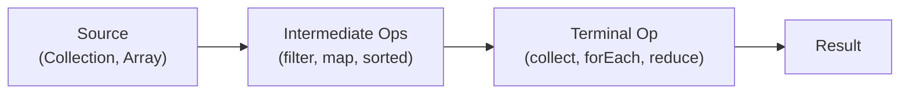
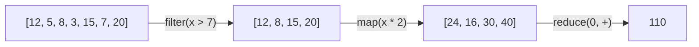

# Module 08: Functional Java

[Previous: JDBC Persistence](07_jdbc_persistence.md) | [Back to Index](README.md) | [Next: Java Swing GUI](09_swing_gui.md)

---

## 8.1 Lambda Expressions

A **lambda expression** is an anonymous function -- a concise way to represent a single method implementation that can be passed as an argument or stored in a variable. Introduced in Java 8, lambdas enable a functional programming style within Java's object-oriented framework.

### 8.1.1 Syntax

```java
(parameters) -> expression            // Single expression; result is implicitly returned
(parameters) -> { statements; }       // Block body; explicit return needed if non-void
```

Examples:

```java
// No parameters
Runnable task = () -> System.out.println("Running");

// Single parameter (parentheses optional)
Consumer<String> printer = s -> System.out.println(s);

// Multiple parameters
BinaryOperator<Integer> add = (a, b) -> a + b;
```

### 8.1.2 Lambda vs. Anonymous Class

Lambdas replace verbose anonymous inner classes when implementing single-method interfaces:

```java
// Before lambdas (Java 7)
Comparator<String> comp = new Comparator<String>() {
    @Override
    public int compare(String a, String b) {
        return a.length() - b.length();
    }
};

// With lambdas (Java 8+)
Comparator<String> comp = (a, b) -> a.length() - b.length();
```

---

## 8.2 Functional Interfaces

A **functional interface** is an interface that contains exactly one abstract method. It may have any number of default or static methods. The `@FunctionalInterface` annotation enforces this constraint at compile time.

### 8.2.1 Built-in Functional Interfaces

| Interface | Method | Input | Output | Use Case |
|-----------|--------|-------|--------|----------|
| `Predicate<T>` | `test(T t)` | T | boolean | Filtering, conditions |
| `Function<T, R>` | `apply(T t)` | T | R | Transformation |
| `Consumer<T>` | `accept(T t)` | T | void | Side effects (printing, saving) |
| `Supplier<T>` | `get()` | none | T | Lazy value generation |
| `BinaryOperator<T>` | `apply(T a, T b)` | T, T | T | Reduction (sum, max) |
| `UnaryOperator<T>` | `apply(T t)` | T | T | In-place transformation |

### 8.2.2 Custom Functional Interface

```java
@FunctionalInterface
public interface Validator<T> {
    boolean validate(T input);
}

// Usage:
Validator<String> emailValidator = s -> s.contains("@") && s.contains(".");
```

---

## 8.3 Method References

Method references are shorthand for lambdas that call an existing method. They use the `::` operator.

| Type | Syntax | Lambda Equivalent |
|------|--------|-------------------|
| Static method | `Class::staticMethod` | `x -> Class.staticMethod(x)` |
| Instance method (bound) | `instance::method` | `x -> instance.method(x)` |
| Instance method (unbound) | `Class::method` | `(obj, x) -> obj.method(x)` |
| Constructor | `Class::new` | `x -> new Class(x)` |

---

## 8.4 The Stream API

The Stream API provides a declarative, pipeline-based approach to processing collections. A stream does not store data; it processes elements from a source through a pipeline of operations.

### 8.4.1 Stream Pipeline Structure



- **Source**: A collection, array, or generator function.
- **Intermediate operations**: Transform the stream and return a new stream. They are **lazy** -- not executed until a terminal operation is invoked.
- **Terminal operations**: Trigger pipeline execution and produce a result or side effect.

### 8.4.2 Key Intermediate Operations

| Operation | Description | Example |
|-----------|-------------|---------|
| `filter(Predicate)` | Retains elements matching the condition | `.filter(x -> x > 10)` |
| `map(Function)` | Transforms each element | `.map(String::toUpperCase)` |
| `sorted()` | Sorts elements in natural order | `.sorted()` |
| `distinct()` | Removes duplicates | `.distinct()` |
| `limit(n)` | Takes only the first n elements | `.limit(5)` |
| `flatMap(Function)` | Flattens nested streams | `.flatMap(List::stream)` |

### 8.4.3 Key Terminal Operations

| Operation | Description | Return Type |
|-----------|-------------|-------------|
| `collect(Collector)` | Accumulates into a collection | Collection |
| `forEach(Consumer)` | Performs action on each element | void |
| `reduce(BinaryOperator)` | Combines elements into one | Optional |
| `count()` | Counts elements | long |
| `anyMatch(Predicate)` | Checks if any element matches | boolean |
| `findFirst()` | Returns first element | Optional |

### 8.4.4 Filter / Map / Reduce Diagram



---

## 8.5 Optional

`Optional<T>` is a container that may or may not hold a non-null value. It is used to express the possibility of absence and avoid `NullPointerException`.

```java
Optional<String> result = findUserById(42);
String name = result.orElse("Unknown");         // Returns "Unknown" if empty
result.ifPresent(n -> System.out.println(n));    // Executes only if value is present
```

---

## Code in Practice

```java
import java.util.Arrays;
import java.util.List;
import java.util.Map;
import java.util.Optional;
import java.util.function.Function;
import java.util.function.Predicate;
import java.util.stream.Collectors;

/**
 * Module 08: Functional Java - Code in Practice
 * Demonstrates lambdas, functional interfaces, method references,
 * and the Stream API (filter/map/reduce).
 */
public class FunctionalDemo {

    public static void main(String[] args) {

        // --- Section 1: Lambda Expressions ---
        // Lambdas replace single-method anonymous classes with concise syntax.
        List<String> names = Arrays.asList("Charlie", "Alice", "Bob", "Diana", "Eve");

        // Sort by string length using a lambda as a Comparator
        names.sort((a, b) -> a.length() - b.length());
        System.out.println("--- Sorted by Length ---");
        System.out.println(names);

        // --- Section 2: Built-in Functional Interfaces ---
        // Predicate: takes an input, returns a boolean
        Predicate<String> isLongName = name -> name.length() > 3;

        // Function: transforms one type into another
        Function<String, String> toUpperCase = String::toUpperCase; // Method reference

        System.out.println("\n--- Predicate + Function ---");
        for (String name : names) {
            if (isLongName.test(name)) {
                System.out.println("  Long name (uppercase): " + toUpperCase.apply(name));
            }
        }

        // --- Section 3: Stream API - Filter / Map / Collect ---
        List<Integer> numbers = Arrays.asList(12, 5, 8, 3, 15, 7, 20, 1, 18);

        // Pipeline: filter numbers > 7, double them, collect to a list
        List<Integer> processed = numbers.stream()
            .filter(n -> n > 7)                // Intermediate: keep only values > 7
            .map(n -> n * 2)                   // Intermediate: double each value
            .sorted()                          // Intermediate: natural ascending order
            .collect(Collectors.toList());     // Terminal: gather results into a List

        System.out.println("\n--- Stream: Filter > Map > Collect ---");
        System.out.println("Original: " + numbers);
        System.out.println("Processed (>7, *2, sorted): " + processed);

        // --- Section 4: Stream API - Reduce ---
        // Reduce combines all elements into a single result.
        int sum = numbers.stream()
            .filter(n -> n > 7)
            .reduce(0, Integer::sum);  // Identity=0, accumulator=Integer.sum()

        System.out.println("\n--- Stream: Reduce ---");
        System.out.println("Sum of elements > 7: " + sum);

        // --- Section 5: Stream API - Grouping ---
        // Collectors.groupingBy partitions elements by a classifier function.
        List<String> words = Arrays.asList("Java", "Go", "Rust", "Python", "C", "Kotlin");

        Map<Integer, List<String>> byLength = words.stream()
            .collect(Collectors.groupingBy(String::length));

        System.out.println("\n--- Stream: Group by Length ---");
        byLength.forEach((len, group) ->
            System.out.println("  Length " + len + ": " + group));

        // --- Section 6: Optional ---
        // Optional avoids NullPointerException by making absence explicit.
        Optional<String> found = names.stream()
            .filter(n -> n.startsWith("D"))
            .findFirst();

        System.out.println("\n--- Optional ---");
        System.out.println("Starts with D: " + found.orElse("Not found"));

        Optional<String> missing = names.stream()
            .filter(n -> n.startsWith("Z"))
            .findFirst();
        System.out.println("Starts with Z: " + missing.orElse("Not found"));

        // --- Section 7: Chaining and Statistics ---
        // IntStream provides numeric-specific terminal operations.
        System.out.println("\n--- Stream Statistics ---");
        numbers.stream()
            .mapToInt(Integer::intValue)   // Convert Stream<Integer> to IntStream
            .summaryStatistics();          // Returns count, sum, min, avg, max

        var stats = numbers.stream().mapToInt(Integer::intValue).summaryStatistics();
        System.out.println("Count: " + stats.getCount());
        System.out.println("Sum:   " + stats.getSum());
        System.out.println("Min:   " + stats.getMin());
        System.out.println("Max:   " + stats.getMax());
        System.out.printf("Avg:   %.2f%n", stats.getAverage());
    }
}
```

---

[Previous: JDBC Persistence](07_jdbc_persistence.md) | [Back to Index](README.md) | [Next: Java Swing GUI](09_swing_gui.md)
