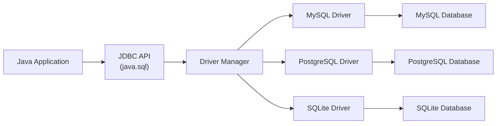
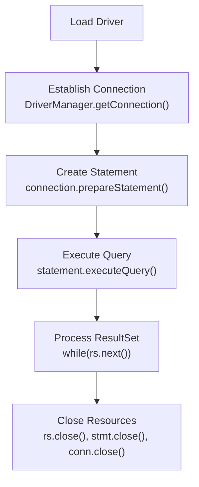

# Module 08: JDBC Persistence

[Previous: Collections and Generics](07_collections_generics.md) | [Back to Index](README.md) | [Next: Functional Java](09_functional_java.md)

---

## 8.1 What is JDBC?

**Java Database Connectivity (JDBC)** is the standard API for connecting Java applications to relational databases. It provides a uniform interface that works with any database that has a JDBC driver (MySQL, PostgreSQL, Oracle, SQLite, etc.).

### 8.1.1 JDBC Architecture



The JDBC API resides in `java.sql` and `javax.sql`. The application code interacts only with the API; the driver handles the vendor-specific communication protocol.

---

## 8.2 Core JDBC Interfaces

### 8.2.1 Connection

Represents a session with the database. Obtained from `DriverManager.getConnection()`. All SQL operations require an active connection.

### 8.2.2 Statement and PreparedStatement

- `Statement` -- Executes static SQL strings. Vulnerable to SQL injection.
- `PreparedStatement` -- Precompiles parameterized SQL. Prevents SQL injection and improves performance for repeated queries.

### 8.2.3 ResultSet

Represents the result of a `SELECT` query. It is a cursor that iterates over the returned rows.

### 8.2.4 JDBC Lifecycle



**Critical Rule**: Always close resources in reverse order of creation, preferably using try-with-resources.

---

## 8.3 Connection Management

### 8.3.1 Connection URL Format

```
jdbc:mysql://hostname:port/database_name
jdbc:postgresql://hostname:port/database_name
jdbc:sqlite:filename.db
```

### 8.3.2 try-with-resources

Java 7 introduced try-with-resources to guarantee that `Connection`, `Statement`, and `ResultSet` objects are closed automatically, even if an exception occurs.

```java
try (Connection conn = DriverManager.getConnection(URL, USER, PASS);
     PreparedStatement stmt = conn.prepareStatement(sql);
     ResultSet rs = stmt.executeQuery()) {
    // Process results
} // All three resources are automatically closed here
```

---

## 8.4 CRUD Operations

CRUD stands for **Create, Read, Update, Delete** -- the four fundamental operations of persistent storage.

### 8.4.1 SQL Operation Mapping

| CRUD | SQL | JDBC Method |
|------|-----|-------------|
| Create | `INSERT INTO` | `executeUpdate()` |
| Read | `SELECT` | `executeQuery()` |
| Update | `UPDATE` | `executeUpdate()` |
| Delete | `DELETE` | `executeUpdate()` |

`executeQuery()` returns a `ResultSet`. `executeUpdate()` returns an `int` (number of affected rows).

---

## 8.5 SQL Injection Prevention

**SQL Injection** is an attack where malicious SQL is inserted through user input. `PreparedStatement` neutralizes this threat by separating SQL logic from data.

```java
// VULNERABLE: String concatenation
String sql = "SELECT * FROM users WHERE name = '" + userInput + "'";
// If userInput = "'; DROP TABLE users; --" the table is deleted.

// SAFE: Parameterized query
String sql = "SELECT * FROM users WHERE name = ?";
PreparedStatement stmt = conn.prepareStatement(sql);
stmt.setString(1, userInput);  // Input is treated as data, never as SQL
```

---

## Code in Practice

```java
import java.sql.Connection;
import java.sql.DriverManager;
import java.sql.PreparedStatement;
import java.sql.ResultSet;
import java.sql.SQLException;
import java.sql.Statement;

/**
 * Module 08: JDBC Persistence - Code in Practice
 * Demonstrates database connectivity, CRUD operations with PreparedStatement,
 * and proper resource management using try-with-resources.
 *
 * Prerequisites:
 *   - MySQL or MariaDB running on localhost:3306
 *   - Database 'java_course' created
 *   - MySQL Connector/J JAR on the classpath
 *
 * Setup SQL:
 *   CREATE DATABASE java_course;
 *   USE java_course;
 *   CREATE TABLE products (
 *       id INT AUTO_INCREMENT PRIMARY KEY,
 *       name VARCHAR(100) NOT NULL,
 *       price DECIMAL(10, 2) NOT NULL,
 *       quantity INT DEFAULT 0
 *   );
 */
public class JdbcDemo {

    // Connection constants: externalize these in production (e.g., properties file)
    private static final String URL  = "jdbc:mysql://localhost:3306/java_course";
    private static final String USER = "root";
    private static final String PASS = "password";

    public static void main(String[] args) {
        // Execute CRUD operations in sequence
        createProduct("Mechanical Keyboard", 89.99, 50);
        createProduct("Wireless Mouse", 34.99, 120);
        createProduct("USB-C Hub", 45.00, 75);

        System.out.println("--- All Products (Read) ---");
        readAllProducts();

        updateProductPrice("Mechanical Keyboard", 79.99);
        System.out.println("\n--- After Price Update ---");
        readAllProducts();

        deleteProduct("USB-C Hub");
        System.out.println("\n--- After Deletion ---");
        readAllProducts();
    }

    /**
     * CREATE: Inserts a new product into the database.
     * Uses PreparedStatement to prevent SQL injection.
     */
    public static void createProduct(String name, double price, int quantity) {
        String sql = "INSERT INTO products (name, price, quantity) VALUES (?, ?, ?)";

        // try-with-resources ensures connection and statement are closed automatically
        try (Connection conn = DriverManager.getConnection(URL, USER, PASS);
             PreparedStatement stmt = conn.prepareStatement(sql)) {

            stmt.setString(1, name);       // Binds 'name' to the first ? placeholder
            stmt.setDouble(2, price);      // Binds 'price' to the second ?
            stmt.setInt(3, quantity);       // Binds 'quantity' to the third ?

            int rowsAffected = stmt.executeUpdate(); // Returns count of inserted rows
            System.out.println("Inserted '" + name + "' (" + rowsAffected + " row)");

        } catch (SQLException e) {
            System.err.println("Create failed: " + e.getMessage());
        }
    }

    /**
     * READ: Retrieves and prints all products from the database.
     * ResultSet is iterated row by row using next().
     */
    public static void readAllProducts() {
        String sql = "SELECT id, name, price, quantity FROM products";

        try (Connection conn = DriverManager.getConnection(URL, USER, PASS);
             Statement stmt = conn.createStatement();
             ResultSet rs = stmt.executeQuery(sql)) {

            // rs.next() advances the cursor to the next row; returns false when exhausted
            while (rs.next()) {
                int id = rs.getInt("id");
                String name = rs.getString("name");
                double price = rs.getDouble("price");
                int qty = rs.getInt("quantity");

                System.out.printf("  [%d] %s - $%.2f (qty: %d)%n", id, name, price, qty);
            }

        } catch (SQLException e) {
            System.err.println("Read failed: " + e.getMessage());
        }
    }

    /**
     * UPDATE: Modifies the price of a product identified by name.
     */
    public static void updateProductPrice(String name, double newPrice) {
        String sql = "UPDATE products SET price = ? WHERE name = ?";

        try (Connection conn = DriverManager.getConnection(URL, USER, PASS);
             PreparedStatement stmt = conn.prepareStatement(sql)) {

            stmt.setDouble(1, newPrice);
            stmt.setString(2, name);

            int rowsAffected = stmt.executeUpdate();
            System.out.println("Updated '" + name + "' (" + rowsAffected + " row)");

        } catch (SQLException e) {
            System.err.println("Update failed: " + e.getMessage());
        }
    }

    /**
     * DELETE: Removes a product by name from the database.
     */
    public static void deleteProduct(String name) {
        String sql = "DELETE FROM products WHERE name = ?";

        try (Connection conn = DriverManager.getConnection(URL, USER, PASS);
             PreparedStatement stmt = conn.prepareStatement(sql)) {

            stmt.setString(1, name);

            int rowsAffected = stmt.executeUpdate();
            System.out.println("Deleted '" + name + "' (" + rowsAffected + " row)");

        } catch (SQLException e) {
            System.err.println("Delete failed: " + e.getMessage());
        }
    }
}
```

---

[Previous: Collections and Generics](07_collections_generics.md) | [Back to Index](README.md) | [Next: Functional Java](09_functional_java.md)
