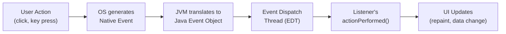
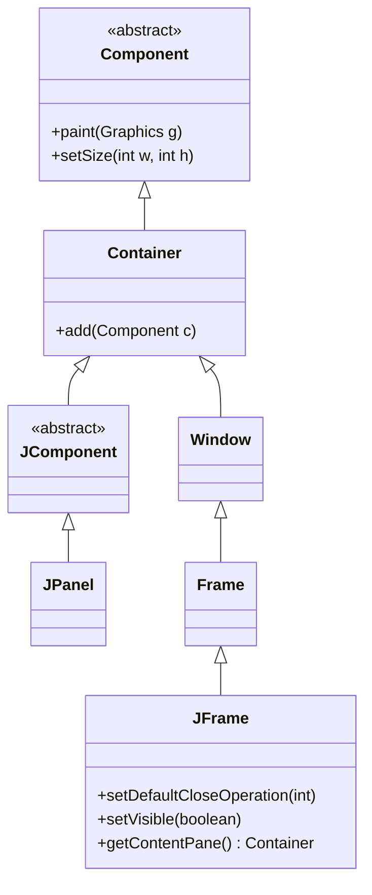

# Module 09: Java Swing GUI

[Previous: Functional Java](08_functional_java.md) | [Back to Index](README.md) | [Next: Git Version Control](10_git_version_control.md)

---

## 9.1 Event-Driven Programming

Traditional procedural programs execute from top to bottom in a predetermined sequence. Graphical user interface (GUI) programs operate under a fundamentally different paradigm: **event-driven programming**. In this model, the application initialises its components and then enters an idle state, waiting for user-generated events such as button clicks, keystrokes, or mouse movements. Each event triggers a corresponding handler, known as a **listener**, which contains the response logic.

### 9.1.1 The Event Dispatch Thread

Swing is **not thread-safe**. All creation and modification of Swing components must occur on a dedicated thread called the **Event Dispatch Thread (EDT)**. Performing long-running operations on the EDT causes the UI to freeze. The `SwingUtilities.invokeLater()` method schedules a `Runnable` to execute on the EDT, which is the correct entry point for any Swing application.

```java
SwingUtilities.invokeLater(() -> {
    // All Swing component creation must happen here, on the EDT
    new MyFrame().setVisible(true);
});
```

### 9.1.2 Event Flow Architecture



---

## 9.2 The JFrame and JPanel

`JFrame` is the top-level window container. It provides the title bar, window borders, and the close/minimise/maximise controls. You should never draw directly on a `JFrame`; instead, add a `JPanel` to it.

`JPanel` is a general-purpose lightweight container used for grouping components and custom painting. It acts as the canvas on which you arrange other components.

### 9.2.1 JFrame Hierarchy



### 9.2.2 Essential JFrame Configuration

| Method | Purpose |
|--------|---------|
| `setTitle(String)` | Sets the window title bar text |
| `setSize(int, int)` | Sets width and height in pixels |
| `setLocationRelativeTo(null)` | Centers the window on screen |
| `setDefaultCloseOperation(JFrame.EXIT_ON_CLOSE)` | Terminates the JVM when the window is closed |
| `setResizable(boolean)` | Enables or disables window resizing |
| `pack()` | Sizes the window to fit its contents |

---

## 9.3 Layout Managers

A **Layout Manager** is an object that determines the size and position of components within a container. Swing deliberately separates layout logic from component logic, allowing the same components to be rearranged by swapping the layout manager.

### 9.3.1 FlowLayout

The default layout for `JPanel`. Arranges components in a horizontal row, wrapping to the next line when the row is full.

```java
panel.setLayout(new FlowLayout(FlowLayout.LEFT, 10, 5));
// Alignment: LEFT. Horizontal gap: 10px. Vertical gap: 5px.
```

### 9.3.2 BorderLayout

The default layout for `JFrame`'s content pane. Divides the container into five regions: `NORTH`, `SOUTH`, `EAST`, `WEST`, and `CENTER`. Each region can hold one component.

```
+-----------------------------+
|           NORTH             |
+------+----------+-----------+
| WEST |  CENTER  |   EAST    |
+------+----------+-----------+
|           SOUTH             |
+-----------------------------+
```

### 9.3.3 GridLayout

Arranges components in a uniform grid of rows and columns. Every cell is the same size.

```java
panel.setLayout(new GridLayout(3, 2, 5, 5));
// 3 rows, 2 columns. Horizontal gap: 5px. Vertical gap: 5px.
```

### 9.3.4 GridBagLayout

The most flexible layout manager. Allows components to span multiple rows or columns and assigns weights to control how extra space is distributed. It requires a `GridBagConstraints` object to configure each component.

---

## 9.4 Common Swing Components

| Component | Class | Purpose |
|-----------|-------|---------|
| Label | `JLabel` | Displays non-editable text or an image |
| Button | `JButton` | A clickable button that fires `ActionEvent` |
| Text field | `JTextField` | Single-line text input |
| Text area | `JTextArea` | Multi-line text input |
| Checkbox | `JCheckBox` | Binary on/off toggle |
| Radio button | `JRadioButton` | Mutually exclusive selection within a `ButtonGroup` |
| Combo box | `JComboBox` | Drop-down selection list |
| List | `JList` | Scrollable list of selectable items |

---

## 9.5 ActionListeners

An `ActionListener` is a functional interface that responds to action events, most commonly button clicks. It declares a single method: `actionPerformed(ActionEvent e)`.

### 9.5.1 Registering a Listener

```java
JButton submitButton = new JButton("Submit");

// Attach the listener using a lambda (ActionListener is a functional interface)
submitButton.addActionListener(e -> {
    // 'e' is the ActionEvent; e.getSource() returns the component that fired the event
    System.out.println("Button clicked at: " + e.getWhen());
});
```

### 9.5.2 The ActionEvent Object

The `ActionEvent` passed to `actionPerformed` provides:
- `getSource()` — the component that originated the event.
- `getActionCommand()` — the command string (defaults to button label).
- `getWhen()` — the timestamp of the event in milliseconds.

---

## Code in Practice

```java
import javax.swing.*;
import java.awt.*;
import java.awt.event.ActionEvent;
import java.awt.event.ActionListener;

/**
 * Module 09: Java Swing GUI - Code in Practice
 *
 * Demonstrates JFrame, JPanel, BorderLayout, FlowLayout, common components,
 * and ActionListener-based event handling. All Swing work is performed
 * on the Event Dispatch Thread via SwingUtilities.invokeLater().
 */
public class SwingGUIDemo {

    // Instance variables for components that need to be accessed across methods
    private JFrame frame;
    private JTextField nameField;
    private JTextField ageField;
    private JTextArea outputArea;
    private JLabel statusLabel;

    public SwingGUIDemo() {
        // Build the entire UI from the constructor, called from the EDT
        initialiseFrame();
        buildUI();
        frame.setVisible(true); // Make the window visible only after all components are added
    }

    /**
     * Configures the top-level JFrame window.
     * EXIT_ON_CLOSE ensures the JVM terminates when the window is closed.
     */
    private void initialiseFrame() {
        frame = new JFrame("Java Swing GUI Demo");
        frame.setDefaultCloseOperation(JFrame.EXIT_ON_CLOSE);
        frame.setSize(500, 400);
        frame.setLocationRelativeTo(null); // null centres the window on screen
        frame.setResizable(false);         // Fixed window size for this demo
    }

    /**
     * Constructs and arranges all UI components.
     * Uses BorderLayout at the frame level, subdivided with nested JPanels.
     */
    private void buildUI() {
        // The content pane is the root container of a JFrame; it uses BorderLayout by default
        Container contentPane = frame.getContentPane();

        // --- NORTH: Title label ---
        JLabel titleLabel = new JLabel("User Registration Form", SwingConstants.CENTER);
        titleLabel.setFont(new Font("Arial", Font.BOLD, 16)); // Custom font for emphasis
        titleLabel.setBorder(BorderFactory.createEmptyBorder(10, 0, 10, 0)); // Padding
        contentPane.add(titleLabel, BorderLayout.NORTH);

        // --- CENTER: Input form panel ---
        // GridLayout ensures labels and fields are aligned in two uniform columns
        JPanel formPanel = new JPanel(new GridLayout(3, 2, 10, 10));
        formPanel.setBorder(BorderFactory.createEmptyBorder(10, 30, 10, 30)); // Inner padding

        JLabel nameLabel = new JLabel("Full Name:");
        nameField = new JTextField(); // Single-line text input for name

        JLabel ageLabel = new JLabel("Age:");
        ageField = new JTextField(); // Single-line text input for age

        statusLabel = new JLabel("Status: Awaiting input.");
        statusLabel.setForeground(Color.GRAY); // Visual cue to distinguish status from labels

        formPanel.add(nameLabel);
        formPanel.add(nameField);
        formPanel.add(ageLabel);
        formPanel.add(ageField);
        formPanel.add(new JLabel()); // Empty cell to maintain grid alignment
        formPanel.add(statusLabel);

        contentPane.add(formPanel, BorderLayout.CENTER);

        // --- EAST: Output area ---
        outputArea = new JTextArea(10, 15);
        outputArea.setEditable(false); // Read-only: used for displaying results, not input
        outputArea.setBorder(BorderFactory.createTitledBorder("Registered Users"));
        outputArea.setFont(new Font("Monospaced", Font.PLAIN, 12)); // Monospaced for alignment

        // JScrollPane wraps the JTextArea to provide scrollbars when content overflows
        JScrollPane scrollPane = new JScrollPane(outputArea);
        contentPane.add(scrollPane, BorderLayout.EAST);

        // --- SOUTH: Button panel ---
        // FlowLayout centres the buttons horizontally with a gap between them
        JPanel buttonPanel = new JPanel(new FlowLayout(FlowLayout.CENTER, 15, 10));

        JButton registerButton = new JButton("Register");
        JButton clearButton = new JButton("Clear");

        // Register the ActionListener using a lambda; equivalent to an anonymous inner class
        registerButton.addActionListener(e -> handleRegister());
        clearButton.addActionListener(e -> handleClear());

        buttonPanel.add(registerButton);
        buttonPanel.add(clearButton);
        contentPane.add(buttonPanel, BorderLayout.SOUTH);
    }

    /**
     * Event handler for the Register button.
     * Validates input, updates the output area, and sets a status message.
     * This method is called on the EDT, so it is safe to modify UI components directly.
     */
    private void handleRegister() {
        String name = nameField.getText().trim(); // trim() removes accidental leading/trailing spaces
        String ageText = ageField.getText().trim();

        // Validate that both fields are populated before processing
        if (name.isEmpty() || ageText.isEmpty()) {
            statusLabel.setText("Status: All fields are required.");
            statusLabel.setForeground(Color.RED);
            return; // Exit early; do not process incomplete data
        }

        try {
            int age = Integer.parseInt(ageText); // May throw NumberFormatException if not numeric

            if (age < 0 || age > 150) {
                statusLabel.setText("Status: Enter a valid age (0-150).");
                statusLabel.setForeground(Color.RED);
                return;
            }

            // Append the registered user to the read-only output area
            outputArea.append(String.format("%-15s | %d%n", name, age));
            statusLabel.setText("Status: Registered successfully.");
            statusLabel.setForeground(new Color(0, 128, 0)); // Dark green for success

            // Clear input fields to prepare for the next entry
            nameField.setText("");
            ageField.setText("");
            nameField.requestFocus(); // Return keyboard focus to the first field

        } catch (NumberFormatException ex) {
            // Provide a specific error message rather than letting the exception propagate silently
            statusLabel.setText("Status: Age must be a whole number.");
            statusLabel.setForeground(Color.RED);
        }
    }

    /**
     * Event handler for the Clear button.
     * Resets all input fields and the status label to their initial state.
     */
    private void handleClear() {
        nameField.setText("");
        ageField.setText("");
        statusLabel.setText("Status: Awaiting input.");
        statusLabel.setForeground(Color.GRAY);
        nameField.requestFocus();
    }

    /**
     * Application entry point.
     * SwingUtilities.invokeLater() schedules the UI construction on the EDT,
     * satisfying Swing's single-thread safety requirement.
     */
    public static void main(String[] args) {
        SwingUtilities.invokeLater(() -> new SwingGUIDemo());
    }
}
```

---

[Previous: Functional Java](08_functional_java.md) | [Back to Index](README.md) | [Next: Git Version Control](10_git_version_control.md)
