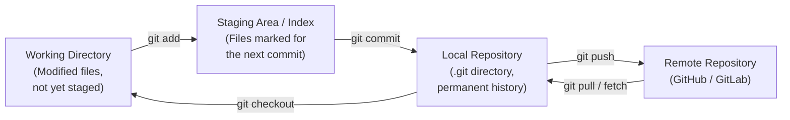

# Module 10: Git Version Control

[Previous: Java Swing GUI](09_swing_gui.md) | [Back to Index](README.md) | [Next: Concurrency](11_concurrency.md)

---

## 10.1 What is Version Control?

**Version control** is a system that records changes to files over time, enabling developers to recall specific versions later, compare changes across time, and collaborate without overwriting each other's work. Git is the industry-standard distributed version control system (DVCS). Unlike centralised systems, every developer holds a complete copy of the repository history on their local machine, enabling offline work and faster operations.

### 10.1.1 Core Terminology

| Term | Definition |
|------|-----------|
| **Repository (repo)** | A directory tracked by Git, containing all files and their full history |
| **Commit** | A snapshot of the repository at a specific point in time |
| **Branch** | A lightweight, movable pointer to a commit |
| **HEAD** | A pointer to the currently checked-out commit or branch |
| **Remote** | A repository hosted on a server (e.g., GitHub, GitLab) |
| **Clone** | A local copy of a remote repository, including all history |

---

## 10.2 The Three-Stage Architecture

Every file in a Git repository exists in one of three states, corresponding to three distinct areas.



### 10.2.1 Working Directory

The working directory is the local filesystem view of the project. Files here may be **untracked** (new, never added to Git) or **tracked and modified** (previously committed, now changed). Git does not automatically record any of these changes.

### 10.2.2 Staging Area (Index)

The staging area holds the exact set of changes intended for the next commit. This separates the act of editing from the act of recording. A developer may modify five files but stage only three, producing a focused, logically coherent commit.

```bash
git add src/Main.java          # Stage a single file
git add src/                   # Stage all changes within a directory
git add -p                     # Interactively stage individual hunks
```

### 10.2.3 Local Repository

The local repository is the `.git` directory at the root of the project. It stores all commits, branches, tags, and configuration.

```bash
git commit -m "feat: add user registration validation logic"
# Convention: use the imperative mood in commit messages
```

---

## 10.3 Branching Strategy

Branches enable multiple features or bug fixes to be developed concurrently without interference.

### 10.3.1 Common Branch Commands

```bash
git branch                      # List all local branches
git branch feature/user-auth    # Create a new branch
git switch feature/user-auth    # Switch to the branch (modern syntax)
git switch -c feature/payment   # Create and switch in one command
git branch -d feature/user-auth # Delete a merged branch
git branch -D feature/user-auth # Force-delete an unmerged branch
```

### 10.3.2 Feature Branch Workflow

```
main:    A --- B --------- F  (merge commit)
                \         /
feature:         C --- D -E
```

1. Create a feature branch from `main`.
2. Commit work incrementally on the feature branch.
3. Merge back into `main` when complete and reviewed.

---

## 10.4 Merging and Rebase

### 10.4.1 git merge

`git merge` combines two branch histories by creating a new merge commit with two parents. This preserves the full branching history.

```bash
git switch main
git merge feature/login
```

### 10.4.2 git rebase

`git rebase` rewrites the feature branch commits as if they were created on top of the current tip of the target branch. This produces a linear history without merge commits.

```
Before rebase:                After rebase:
A - B - C  (main)            A - B - C  (main)
    \                                    \
     D - E  (feature)                    D' - E'  (feature, replayed)
```

**Rule**: Never rebase commits that have already been pushed to a shared remote branch. Rewriting shared history causes conflicts for all collaborators.

---

## 10.5 Merge Conflict Resolution

A **merge conflict** occurs when two branches modify the same region of the same file in incompatible ways.

### 10.5.1 Conflict Markers

Git inserts conflict markers into the affected file:

```
<<<<<<< HEAD
    String greeting = "Hello, World!";   // From the current branch (main)
=======
    String greeting = "Greetings!";      // From the merging branch (feature)
>>>>>>> feature/greeting-update
```

### 10.5.2 Resolution Steps

1. Open the conflicted file in an editor.
2. Decide which change to keep (or combine both).
3. Remove all conflict markers.
4. Stage the resolved file: `git add <filename>`.
5. Complete the merge: `git commit`.

---

## 10.6 Essential Command Reference

| Category | Command | Purpose |
|----------|---------|---------|
| Setup | `git init` | Initialise a new repository |
| Setup | `git clone <url>` | Clone a remote repository |
| State | `git status` | Show working directory and staging area state |
| State | `git log --oneline --graph` | Display compact, visual commit history |
| State | `git diff --staged` | Show staged changes |
| Undo | `git restore <file>` | Discard unstaged changes |
| Undo | `git restore --staged <file>` | Unstage a file |
| Undo | `git revert <commit>` | Create a commit that undoes a previous one (safe) |
| Remote | `git push -u origin main` | Push and set upstream tracking branch |
| Remote | `git pull` | Fetch and merge remote changes |

---

## Code in Practice

```bash
#!/usr/bin/env bash
# Module 10: Git Version Control - Code in Practice
# Demonstrates a complete feature branch workflow from init to merge.

# STEP 1: Initialise a new local repository
git init java-course-project
cd java-course-project
# Git creates a hidden .git directory. This is the local repository.

# STEP 2: Create the project and make the first commit
mkdir -p src/com/example
cat > src/com/example/Main.java << 'EOF'
public class Main {
    public static void main(String[] args) {
        System.out.println("Java Course Project");
    }
}
EOF

git add src/
# Moves the directory to the staging area; nothing is committed yet.

git commit -m "feat: add initial Main class"
# Writes the staged snapshot to the local repository permanently.

# STEP 3: Create and switch to a feature branch
git switch -c feature/add-calculator
# '-c' creates the branch and switches to it in one step.

cat > src/com/example/Calculator.java << 'EOF'
public class Calculator {

    public int add(int a, int b)      { return a + b; }
    public int subtract(int a, int b) { return a - b; }
    public int multiply(int a, int b) { return a * b; }

    public double divide(int a, int b) {
        if (b == 0) {
            // Guard clause: validate before performing the operation
            throw new ArithmeticException("Division by zero is undefined.");
        }
        return (double) a / b; // Cast to double to avoid integer truncation
    }
}
EOF

git add src/com/example/Calculator.java
git commit -m "feat: implement Calculator with basic arithmetic operations"

# STEP 4: View the branch history
git log --oneline --graph --all
# '--oneline' shows one line per commit.
# '--graph'   draws the branch topology in ASCII art.
# '--all'     includes all branches, not just the current one.

# STEP 5: Merge the feature branch into main
git switch main
git merge feature/add-calculator --no-ff
# '--no-ff' forces a merge commit, preserving the historical record
# that a feature branch existed, even when a fast-forward is possible.

# STEP 6: Delete the merged feature branch (cleanup)
git branch -d feature/add-calculator
# '-d' only deletes if the branch is fully merged into HEAD.
# The commits are NOT deleted; they remain reachable from main.

echo "Workflow complete. Calculator feature is now in main."
```

---

[Previous: Java Swing GUI](09_swing_gui.md) | [Back to Index](README.md) | [Next: Concurrency](11_concurrency.md)
