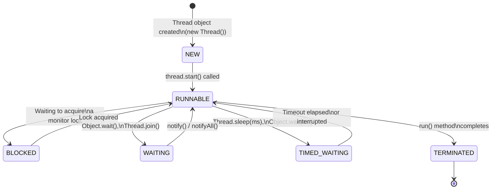
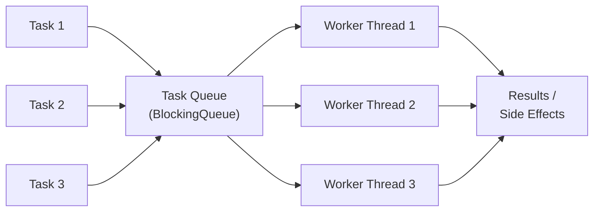

# Module 11: Concurrency

[Previous: Git Version Control](10_git_version_control.md) | [Back to Index](README.md) | [Next: Capstone Integration](12_capstone.md)

---

## 11.1 Concurrency and Threads

A **thread** is the smallest unit of execution within a process. A Java process always has at least one thread: the **main thread**, which executes the `main()` method. Concurrency enables multiple threads to exist simultaneously, sharing the process's memory space. This is distinct from **parallelism**, where threads execute simultaneously on multiple CPU cores. Concurrency is about the structure of the program; parallelism is about physical simultaneous execution.

### 11.1.1 Thread Lifecycle

A Java thread moves through a defined set of states from creation to termination.



---

## 11.2 Creating Threads

Java provides two primary mechanisms for defining the work a thread performs.

### 11.2.1 Extending Thread

A class can extend `Thread` and override its `run()` method. This is the simpler approach but is inflexible because Java does not support multiple inheritance.

```java
public class PrinterThread extends Thread {
    private final String message;

    public PrinterThread(String message) {
        this.message = message;
    }

    @Override
    public void run() {
        // run() defines the task; it is called by the JVM when start() is invoked
        System.out.println(Thread.currentThread().getName() + ": " + message);
    }
}
```

### 11.2.2 Implementing the Runnable Interface

Implementing `Runnable` separates the task definition from the thread mechanism. This is the preferred approach because a class can still extend another class.

```java
public class CounterTask implements Runnable {
    @Override
    public void run() {
        for (int i = 1; i <= 5; i++) {
            System.out.println(Thread.currentThread().getName() + " - Count: " + i);
        }
    }
}

// Usage: wrap the Runnable in a Thread to schedule it
Thread t = new Thread(new CounterTask(), "CounterThread-1");
t.start(); // start() allocates a new call stack and invokes run() on it
// t.run() would execute on the CURRENT thread, not a new one -- a common mistake
```

### 11.2.3 The Callable Interface and Future

`Runnable` cannot return a value or throw a checked exception. `Callable<V>` addresses both limitations. It returns a `Future<V>` that represents the result of an asynchronous computation.

```java
Callable<Integer> task = () -> {
    // Performs computation and returns a value
    return 42;
};
```

---

## 11.3 The Race Condition Problem

When multiple threads read and write shared data without coordination, the result depends on the unpredictable order of thread scheduling. This is a **race condition**. The portion of code that accesses shared state is called the **critical section**.

### 11.3.1 Anatomy of a Race Condition

Consider a counter incremented by two threads:

```
Thread A reads count = 0
Thread B reads count = 0   <-- reads before A writes
Thread A writes count = 1
Thread B writes count = 1  <-- overwrites A's result
Final count = 1            <-- Expected: 2
```

The `count++` operation is not atomic. It decomposes into three steps: read, increment, write. A thread can be preempted between any of these steps.

---

## 11.4 Synchronization

Java's `synchronized` keyword guarantees that only one thread at a time can execute a block or method that holds a given object's **monitor lock** (also called an intrinsic lock).

### 11.4.1 Synchronized Methods

```java
public class SafeCounter {
    private int count = 0;

    // 'synchronized' acquires the lock on 'this' before execution
    public synchronized void increment() {
        count++; // Now atomic with respect to other synchronized methods on this object
    }

    public synchronized int getCount() {
        return count; // Read also synchronized to ensure visibility of the latest value
    }
}
```

### 11.4.2 Synchronized Blocks

Synchronizing on the entire method locks `this` for the full duration. A synchronized block is more granular — it acquires the lock only for the minimum critical section, improving throughput.

```java
private final Object lock = new Object(); // A dedicated lock object

public void process() {
    // Non-critical work executes here without holding any lock
    doPreparation();

    synchronized (lock) {
        // Only this section is protected; other threads block here
        count++;
    }

    // Non-critical work continues here
    doCleanup();
}
```

### 11.4.3 The volatile Keyword

The `volatile` keyword guarantees that reads and writes to a variable are always performed directly from and to main memory, preventing threads from caching a stale copy. It solves visibility but not atomicity.

```java
private volatile boolean running = true; // Threads always read the current value

public void stop() {
    running = false; // Immediately visible to all threads
}
```

---

## 11.5 Thread Pools and the Executor Framework

Creating a new `Thread` for every task is expensive: each thread requires its own call stack (typically 512KB–1MB). The **Executor Framework** manages a reusable pool of worker threads, accepting tasks and dispatching them to available threads.

### 11.5.1 ExecutorService

`ExecutorService` is the primary interface for managing thread pools. `Executors` provides factory methods for common configurations.

| Factory Method | Description |
|----------------|-------------|
| `Executors.newFixedThreadPool(n)` | Pool of exactly `n` threads; excess tasks queue |
| `Executors.newCachedThreadPool()` | Creates threads on demand; reuses idle threads |
| `Executors.newSingleThreadExecutor()` | Single worker thread; tasks execute sequentially |
| `Executors.newScheduledThreadPool(n)` | Supports delayed and periodic task execution |

### 11.5.2 Thread Pool Architecture



### 11.5.3 Shutting Down an ExecutorService

An `ExecutorService` must be explicitly shut down; otherwise its threads prevent the JVM from exiting.

```java
executor.shutdown();        // Stops accepting new tasks; allows queued tasks to complete
executor.awaitTermination(30, TimeUnit.SECONDS); // Wait up to 30s for completion
executor.shutdownNow();     // Interrupts running tasks (use as a last resort)
```

---

## Code in Practice

```java
import java.util.concurrent.*;
import java.util.concurrent.atomic.AtomicInteger;

/**
 * Module 11: Concurrency - Code in Practice
 *
 * Demonstrates thread creation via Runnable, the race condition problem,
 * synchronization, AtomicInteger, and the ExecutorService thread pool.
 */
public class ConcurrencyDemo {

    public static void main(String[] args) throws InterruptedException {
        System.out.println("--- Demo 1: Basic Runnable Thread ---");
        demonstrateRunnable();

        System.out.println("\n--- Demo 2: Race Condition (unsafe counter) ---");
        demonstrateRaceCondition();

        System.out.println("\n--- Demo 3: Synchronized Counter (safe) ---");
        demonstrateSynchronized();

        System.out.println("\n--- Demo 4: Thread Pool with ExecutorService ---");
        demonstrateThreadPool();
    }

    // ------------------------------------------------------------------
    // DEMO 1: Creating a thread using the Runnable interface
    // ------------------------------------------------------------------
    private static void demonstrateRunnable() throws InterruptedException {
        Runnable task = () -> {
            // Lambda implements Runnable.run()
            // Thread.currentThread().getName() retrieves the OS thread name
            System.out.println("Executing on: " + Thread.currentThread().getName());
        };

        Thread t1 = new Thread(task, "WorkerThread-A");
        Thread t2 = new Thread(task, "WorkerThread-B");

        t1.start(); // Schedules t1 on the JVM thread scheduler; returns immediately
        t2.start(); // t1 and t2 now run concurrently; order of output is non-deterministic

        t1.join();  // Causes the calling thread (main) to block until t1 terminates
        t2.join();  // Ensures both threads complete before main proceeds
        System.out.println("Both threads finished.");
    }

    // ------------------------------------------------------------------
    // DEMO 2: Race condition -- unsafe shared counter (for illustration only)
    // ------------------------------------------------------------------
    private static void demonstrateRaceCondition() throws InterruptedException {
        // This counter is NOT thread-safe. The result is unpredictable.
        int[] unsafeCount = {0}; // Array trick to allow lambda access to a mutable value

        Runnable increment = () -> {
            for (int i = 0; i < 1000; i++) {
                unsafeCount[0]++; // Read-increment-write: three steps, NOT atomic
            }
        };

        Thread t1 = new Thread(increment, "UnsafeThread-1");
        Thread t2 = new Thread(increment, "UnsafeThread-2");
        t1.start();
        t2.start();
        t1.join();
        t2.join();

        // Expected: 2000. Actual: less than 2000 (data is lost due to race condition).
        System.out.println("Unsafe count (expected 2000): " + unsafeCount[0]);
    }

    // ------------------------------------------------------------------
    // DEMO 3: Thread-safe counter using AtomicInteger
    // AtomicInteger uses CPU-level compare-and-swap (CAS) for lock-free atomicity
    // ------------------------------------------------------------------
    private static void demonstrateSynchronized() throws InterruptedException {
        AtomicInteger safeCount = new AtomicInteger(0);
        // AtomicInteger.incrementAndGet() is guaranteed atomic; no synchronization block needed.

        Runnable increment = () -> {
            for (int i = 0; i < 1000; i++) {
                safeCount.incrementAndGet(); // Atomic read-increment-write in one CPU instruction
            }
        };

        Thread t1 = new Thread(increment, "SafeThread-1");
        Thread t2 = new Thread(increment, "SafeThread-2");
        t1.start();
        t2.start();
        t1.join();
        t2.join();

        // AtomicInteger guarantees the result is always exactly 2000.
        System.out.println("Safe count (expected 2000): " + safeCount.get());
    }

    // ------------------------------------------------------------------
    // DEMO 4: Thread pool using ExecutorService
    // ------------------------------------------------------------------
    private static void demonstrateThreadPool() throws InterruptedException {
        // Fixed pool of 3 worker threads; a 4th submitted task will queue until a thread is free
        ExecutorService executor = Executors.newFixedThreadPool(3);

        for (int i = 1; i <= 6; i++) {
            final int taskId = i; // Must be effectively final to use inside the lambda

            executor.submit(() -> {
                // submit() places the Runnable in the task queue
                // A pool thread picks it up when available
                System.out.printf("Task %d running on %s%n",
                        taskId, Thread.currentThread().getName());
                try {
                    Thread.sleep(100); // Simulate task duration without busy-waiting
                } catch (InterruptedException e) {
                    // Restore the interrupt flag; do not silently swallow it
                    Thread.currentThread().interrupt();
                }
            });
        }

        executor.shutdown(); // No new tasks; allow queued tasks to complete
        boolean finished = executor.awaitTermination(10, TimeUnit.SECONDS);

        if (finished) {
            System.out.println("All tasks completed. Pool shut down cleanly.");
        } else {
            System.out.println("Timeout elapsed before all tasks completed.");
            executor.shutdownNow(); // Interrupt remaining tasks as a fallback
        }
    }
}
```

---

[Previous: Git Version Control](10_git_version_control.md) | [Back to Index](README.md) | [Next: Capstone Integration](12_capstone.md)
