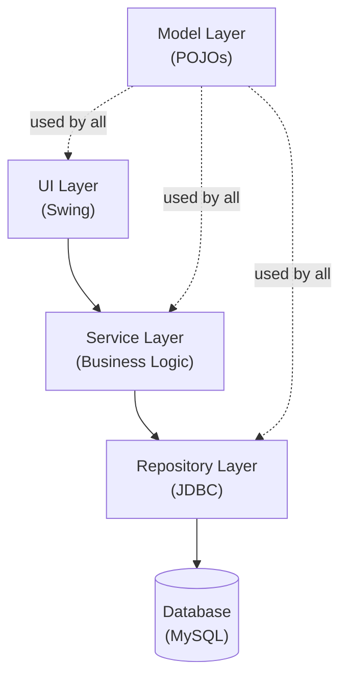

# Module 12: Capstone Integration

[Previous: Concurrency](11_concurrency.md) | [Back to Index](README.md)

---

## 12.1 Capstone Overview

This module integrates every concept introduced in Modules 01 through 11 into a single, cohesive application: a **multi-threaded inventory management system** with a Swing GUI, JDBC persistence, functional data processing, and a Git-managed lifecycle. The capstone does not introduce new language features; it demands that you combine existing skills under the constraints of a production-grade architecture.

### 12.1.1 Learning Objectives

Upon completing the capstone, you will be able to:

- Design a modular Java application with clearly separated concerns.
- Apply OOP principles (encapsulation, inheritance, polymorphism) to real domain models.
- Implement persistence via JDBC with a properly managed `Connection` lifecycle.
- Process collections using the Stream API.
- Build an event-driven Swing UI that delegates to a non-GUI service layer.
- Use a thread pool to offload blocking database operations from the EDT.
- Version the entire codebase with Git, using a feature branch workflow.

---

## 12.2 Modular Architecture

A modular architecture organises code into packages with single, well-defined responsibilities. This enforces the **Separation of Concerns** principle and makes the codebase testable, maintainable, and extensible.

### 12.2.1 Recommended Package Structure

```
inventory-system/
│
├── src/
│   └── com/
│       └── inventory/
│           ├── Main.java                  -- Entry point; wires everything together
│           │
│           ├── model/                     -- Data models (plain Java objects)
│           │   ├── Product.java
│           │   └── Category.java
│           │
│           ├── repository/                -- Data access layer (JDBC only here)
│           │   ├── ProductRepository.java
│           │   └── DatabaseConnection.java
│           │
│           ├── service/                   -- Business logic layer
│           │   └── InventoryService.java
│           │
│           ├── ui/                        -- Swing presentation layer
│           │   ├── MainFrame.java
│           │   └── ProductFormPanel.java
│           │
│           └── util/                      -- Shared utilities
│               └── ValidationUtils.java
│
├── sql/
│   └── schema.sql                         -- Database DDL script
│
├── .gitignore
└── README.md
```

### 12.2.2 Dependency Flow

The dependency rule: inner layers must never depend on outer layers. The UI may call the service layer; the service layer may call the repository; neither should know about the UI.



---

## 12.3 Domain Model

### 12.3.1 The Product Entity

```java
package com.inventory.model;

/**
 * Represents a single inventory product.
 * This is a plain Java object (POJO) with no framework dependencies.
 * It is passed between all layers, keeping them decoupled.
 */
public class Product {
    private int id;             // Set by the database on INSERT; 0 for unsaved products
    private String name;
    private String category;
    private int quantity;
    private double price;

    // Constructor for creating a new product before persistence
    public Product(String name, String category, int quantity, double price) {
        this.name     = name;
        this.category = category;
        this.quantity = quantity;
        this.price    = price;
    }

    // Getters and setters (omitted for brevity; implement all fields)
    public int    getId()       { return id; }
    public void   setId(int id) { this.id = id; }
    public String getName()     { return name; }
    public int    getQuantity() { return quantity; }
    public double getPrice()    { return price; }

    @Override
    public String toString() {
        return String.format("[%d] %s | Qty: %d | Price: £%.2f", id, name, quantity, price);
    }
}
```

---

## 12.4 Database Schema

```sql
-- sql/schema.sql
-- Execute this script once to initialise the database before running the application.

CREATE DATABASE IF NOT EXISTS inventory_db;
USE inventory_db;

CREATE TABLE IF NOT EXISTS products (
    id       INT           AUTO_INCREMENT PRIMARY KEY,
    name     VARCHAR(100)  NOT NULL,
    category VARCHAR(50)   NOT NULL,
    quantity INT           NOT NULL DEFAULT 0,
    price    DECIMAL(10,2) NOT NULL
);
```

---

## 12.5 Repository Layer

```java
package com.inventory.repository;

import com.inventory.model.Product;
import java.sql.*;
import java.util.ArrayList;
import java.util.List;

/**
 * Handles all JDBC interactions for the Product entity.
 * This layer is the only layer that knows SQL exists.
 */
public class ProductRepository {

    private final Connection connection;

    public ProductRepository(Connection connection) {
        // Dependency injection: the connection is managed externally and passed in
        this.connection = connection;
    }

    /** Inserts a new product and populates its generated ID. */
    public void save(Product product) throws SQLException {
        String sql = "INSERT INTO products (name, category, quantity, price) VALUES (?, ?, ?, ?)";
        try (PreparedStatement ps = connection.prepareStatement(sql, Statement.RETURN_GENERATED_KEYS)) {
            ps.setString(1, product.getName());
            ps.setString(2, product.getCategory());
            ps.setInt(3, product.getQuantity());
            ps.setDouble(4, product.getPrice());
            ps.executeUpdate();

            try (ResultSet keys = ps.getGeneratedKeys()) {
                if (keys.next()) {
                    product.setId(keys.getInt(1)); // Back-populate the auto-generated ID
                }
            }
        }
    }

    /** Returns all products, sorted alphabetically by name. */
    public List<Product> findAll() throws SQLException {
        List<Product> products = new ArrayList<>();
        String sql = "SELECT id, name, category, quantity, price FROM products ORDER BY name";
        try (PreparedStatement ps = connection.prepareStatement(sql);
             ResultSet rs = ps.executeQuery()) {
            while (rs.next()) {
                Product p = new Product(
                    rs.getString("name"),
                    rs.getString("category"),
                    rs.getInt("quantity"),
                    rs.getDouble("price")
                );
                p.setId(rs.getInt("id"));
                products.add(p);
            }
        }
        return products;
    }

    /** Deletes a product by its primary key. */
    public void delete(int id) throws SQLException {
        String sql = "DELETE FROM products WHERE id = ?";
        try (PreparedStatement ps = connection.prepareStatement(sql)) {
            ps.setInt(1, id);
            ps.executeUpdate();
        }
    }
}
```

---

## 12.6 Service Layer

```java
package com.inventory.service;

import com.inventory.model.Product;
import com.inventory.repository.ProductRepository;
import java.sql.SQLException;
import java.util.Comparator;
import java.util.List;
import java.util.stream.Collectors;

/**
 * Implements business logic using the Stream API for in-memory processing.
 * This layer knows nothing about SQL or Swing.
 */
public class InventoryService {

    private final ProductRepository repository;

    public InventoryService(ProductRepository repository) {
        this.repository = repository;
    }

    public void addProduct(Product product) throws SQLException {
        // Business rule: name must not be blank
        if (product.getName() == null || product.getName().isBlank()) {
            throw new IllegalArgumentException("Product name cannot be empty.");
        }
        repository.save(product);
    }

    /** Returns all products with quantity below the specified threshold. */
    public List<Product> getLowStockProducts(int threshold) throws SQLException {
        return repository.findAll()
            .stream()
            .filter(p -> p.getQuantity() < threshold) // Retain only low-stock items
            .sorted(Comparator.comparingInt(Product::getQuantity)) // Ascending by quantity
            .collect(Collectors.toList());
    }

    /** Returns the total value of all inventory (sum of quantity * price per product). */
    public double calculateTotalInventoryValue() throws SQLException {
        return repository.findAll()
            .stream()
            .mapToDouble(p -> p.getQuantity() * p.getPrice()) // Map each product to its value
            .sum();
    }
}
```

---

## 12.7 EDT Safety in the UI Layer

The UI layer must never call blocking operations (such as JDBC queries) directly on the EDT. Doing so freezes the window. Use a thread pool to run the service call on a background thread, then use `SwingUtilities.invokeLater()` to update the UI once results are available.

```java
private void handleLoadButtonClick() {
    // Disable the button to prevent double-clicks during the async operation
    loadButton.setEnabled(false);
    statusLabel.setText("Loading...");

    // Submit the blocking operation to a background thread
    executor.submit(() -> {
        try {
            List<Product> products = inventoryService.getLowStockProducts(10);

            // UI update MUST return to the EDT via invokeLater
            SwingUtilities.invokeLater(() -> {
                populateTable(products);
                statusLabel.setText("Loaded " + products.size() + " products.");
                loadButton.setEnabled(true);
            });

        } catch (SQLException e) {
            SwingUtilities.invokeLater(() -> {
                statusLabel.setText("Error: " + e.getMessage());
                loadButton.setEnabled(true);
            });
        }
    });
}
```

---

## 12.8 Testing Strategy

Every layer should have a corresponding test strategy. Use **JUnit 5** for unit tests and mock collaborators with **Mockito**.

### 12.8.1 Unit Testing the Service Layer

```java
import org.junit.jupiter.api.*;
import org.mockito.Mockito;
import java.util.List;

import static org.junit.jupiter.api.Assertions.*;
import static org.mockito.Mockito.*;

class InventoryServiceTest {

    private ProductRepository mockRepository;
    private InventoryService service;

    @BeforeEach
    void setUp() {
        // Mockito creates a fake repository that does not touch any database
        mockRepository = Mockito.mock(ProductRepository.class);
        service = new InventoryService(mockRepository);
    }

    @Test
    @DisplayName("addProduct should throw IllegalArgumentException for blank name")
    void addProduct_blankName_throwsException() {
        Product invalid = new Product("", "Electronics", 10, 99.99);
        // assertThrows verifies that the expected exception type is thrown
        assertThrows(IllegalArgumentException.class, () -> service.addProduct(invalid));
    }

    @Test
    @DisplayName("getLowStockProducts filters products below threshold")
    void getLowStockProducts_returnsOnlyLowStock() throws Exception {
        List<Product> allProducts = List.of(
            createProduct("Widget", 5),
            createProduct("Gadget", 50),
            createProduct("Gizmo", 3)
        );
        when(mockRepository.findAll()).thenReturn(allProducts);

        List<Product> lowStock = service.getLowStockProducts(10);

        assertEquals(2, lowStock.size()); // Widget (5) and Gizmo (3) are below threshold 10
        assertEquals("Gizmo", lowStock.get(0).getName()); // Sorted ascending: 3 first
    }

    private Product createProduct(String name, int quantity) {
        return new Product(name, "General", quantity, 9.99);
    }
}
```

---

## 12.9 Git Workflow for the Capstone

Apply the feature branch workflow from Module 10 throughout the capstone.

```
main
 │
 ├── feat/project-scaffold        (package structure, Main.java, schema.sql)
 ├── feat/repository-layer        (DatabaseConnection, ProductRepository)
 ├── feat/service-layer           (InventoryService, stream operations)
 ├── feat/swing-ui                (MainFrame, ProductFormPanel)
 ├── feat/concurrency             (ExecutorService integration in UI)
 └── feat/testing                 (JUnit 5 test classes)
```

Each branch should be merged to `main` only after it is complete and manually verified. Write a descriptive commit message for every commit following the `type: description` convention.

---

## 12.10 Submission Checklist

Before considering the capstone complete, verify each item:

- [ ] All 12 modules have been studied and the "Code in Practice" examples have been typed and compiled.
- [ ] The database schema is initialised and the application connects successfully.
- [ ] A product can be added, listed, and deleted through the Swing UI.
- [ ] `getLowStockProducts` returns the correct filtered and sorted results.
- [ ] `calculateTotalInventoryValue` produces the correct sum.
- [ ] Database calls are executed on a background thread; the UI does not freeze.
- [ ] All unit tests pass with `mvn test` or the IDE test runner.
- [ ] The repository contains at least one commit per feature branch with descriptive messages.
- [ ] A `.gitignore` excludes compiled `.class` files, IDE configuration, and credentials.
- [ ] The project compiles cleanly with no warnings under JDK 17.

---

## Code in Practice

```java
package com.inventory;

import com.inventory.model.Product;
import com.inventory.repository.DatabaseConnection;
import com.inventory.repository.ProductRepository;
import com.inventory.service.InventoryService;
import com.inventory.ui.MainFrame;

import javax.swing.*;
import java.sql.Connection;
import java.sql.SQLException;
import java.util.List;
import java.util.concurrent.ExecutorService;
import java.util.concurrent.Executors;

/**
 * Module 12: Capstone Integration - Code in Practice
 *
 * This is the application entry point. It wires together the database
 * connection, repository, service, and UI -- demonstrating how all
 * 11 preceding modules converge in a production-grade application.
 */
public class Main {

    public static void main(String[] args) {

        // --- Step 1: Establish the database connection (Module 07) ---
        Connection connection;
        try {
            connection = DatabaseConnection.getConnection(
                "jdbc:mysql://localhost:3306/inventory_db",
                "root",
                "password"
            );
        } catch (SQLException e) {
            // Fatal error: cannot start without a database. Display message and exit.
            JOptionPane.showMessageDialog(null,
                "Database connection failed: " + e.getMessage(),
                "Startup Error",
                JOptionPane.ERROR_MESSAGE);
            return; // Do not proceed to UI construction
        }

        // --- Step 2: Build the layered dependency graph ---
        ProductRepository repository  = new ProductRepository(connection);
        InventoryService  service     = new InventoryService(repository);

        // --- Step 3: Create a thread pool for background database operations (Module 11) ---
        // A fixed pool prevents unbounded thread creation from rapid button clicks.
        ExecutorService executor = Executors.newFixedThreadPool(4);

        // --- Step 4: Launch the Swing UI on the EDT (Module 09) ---
        SwingUtilities.invokeLater(() -> {
            MainFrame frame = new MainFrame(service, executor);
            frame.setVisible(true);
        });

        // --- Step 5: Demonstrate service layer (Modules 06, 08) ---
        // This block runs on the main thread for demonstration purposes.
        // In the real application, these calls are made from the UI layer
        // via the executor, off the EDT.
        executor.submit(() -> {
            try {
                // Add a sample product (Module 07: JDBC, Module 04: OOP)
                Product sample = new Product("Laptop", "Electronics", 8, 1299.99);
                service.addProduct(sample);
                System.out.println("Saved: " + sample);

                // Retrieve low-stock items using Stream API (Module 08)
                List<Product> lowStock = service.getLowStockProducts(10);
                System.out.println("Low stock items:");
                lowStock.forEach(System.out::println); // Method reference

                // Calculate total value (Module 08: reduce via mapToDouble)
                double total = service.calculateTotalInventoryValue();
                System.out.printf("Total inventory value: £%.2f%n", total);

            } catch (SQLException e) {
                System.err.println("Database error during demo: " + e.getMessage());
            } catch (IllegalArgumentException e) {
                System.err.println("Validation error: " + e.getMessage());
            }
        });

        // Note: executor.shutdown() is called by MainFrame's window closing listener
        // to ensure all queued tasks complete before the application exits.
    }
}
```

---

[Previous: Concurrency](11_concurrency.md) | [Back to Index](README.md)
